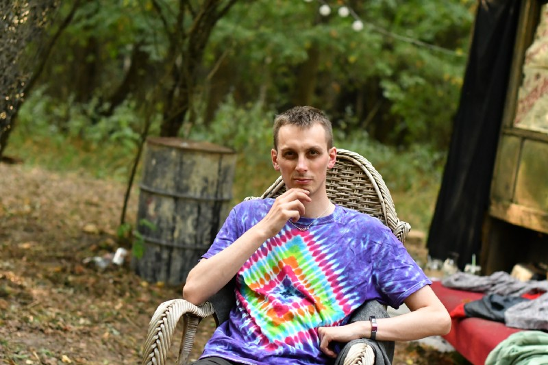
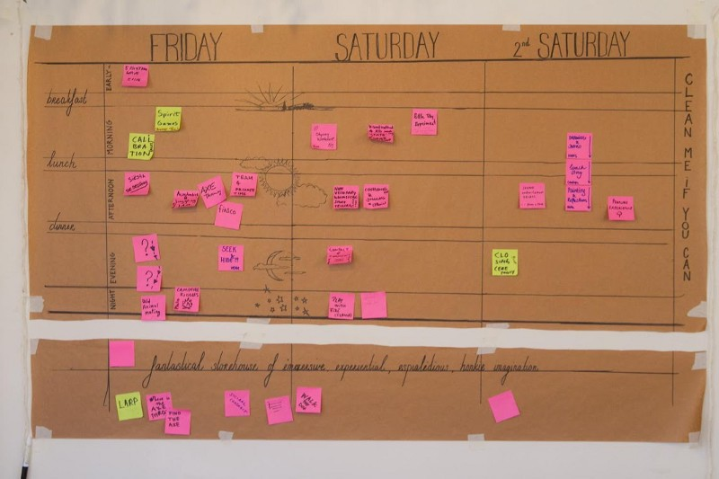
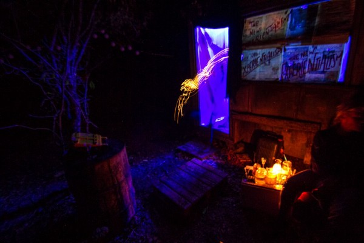
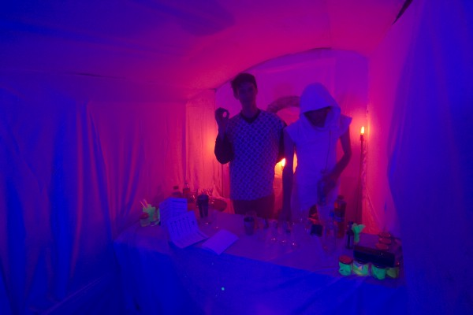
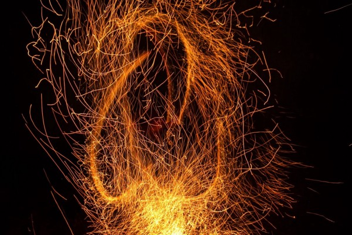
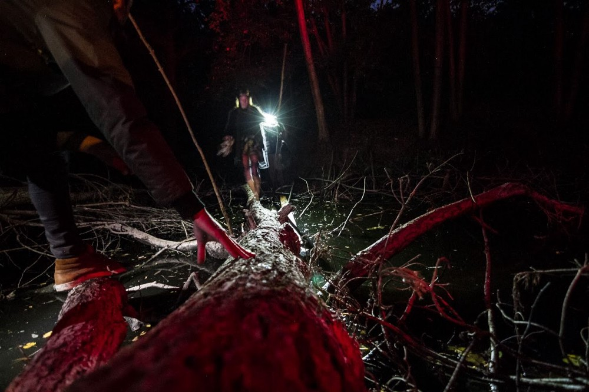
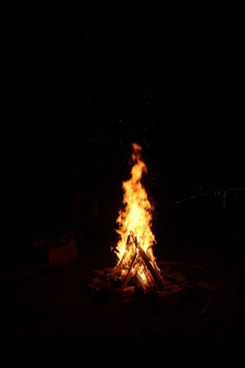
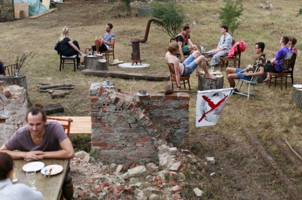
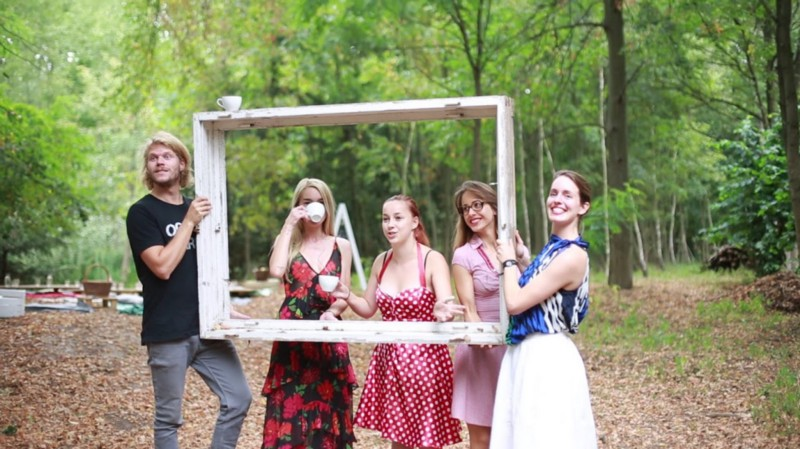
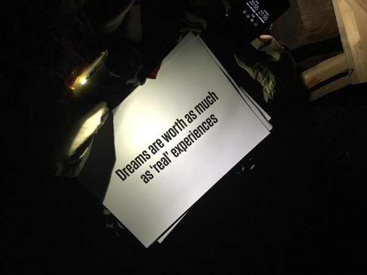

> “You cannot create an experience, you can create \[conditions\] for an experience.” — Seth Minard

Last autumn, I participated in the [Stone Soup](https://stonesoup.live/), an experience design camp (30 Aug–3 Sept 2018, Przyborowo, Poland). It was the second edition, after one in California.

Post-factum, I would call it the _Experience-Makers’ Experience_. When describing it to people, I say _“Burning Man, minus: crowd, desert, drugs or the price tag”_. Is there anything left? Apparently, a lot!

There are parts of LARPs, scout camps, artsy kindergarten projects, improv theatre, and unconference-like workshops. Though, what made it special was this on-site creativity and improvisation. There was a framework, but except for supplies (food and artistic), we were left to own devices.

### Before

I got invited by Magda Jagielska, my closest friend’s closest friend. Looking at the list of participants ([publicly updated as we signed up](https://stonesoup.live/poland-2018)), I got intrigued. On the one hand — creative and successful people, who already contributed to curious projects in experience design. On the other — I was a bit afraid that it may turn into a _“cooler than thou”_\-fest of self-absorbed divas (myself included).

Though, my reasoning was simple: if people sign up for some random, bottom-up improvised event, for its intrinsic value, well… then it is exactly the self-selected crowd I am looking for!

I wanted to experience things that will change my mindset/approach. _“Prepare for unforeseen consequences”_ was not a [G-man](https://en.wikipedia.org/wiki/G-Man_%28Half-Life%29)’s grim threat, it was my wish! I mean, learning a skill or two is cool. So is pure enjoyment/pleasure. Yet, not all nice is impactful, and I aimed for the later.

### Consumption

There was a temptation to write about all the experiences. But… I tried a few times, and it looked meek. Some things were too immersed in the mood & context, others are anything but words. The same way as an Instagram photo of a dish does not transmit its smell, taste, and texture. Unless you are have already experienced something, subtle hints won’t recall the experience.

Some examples, though:

- contact improv & playfighting (I co-lead)
- fire dance show
- dynamic medication (~releasing emotions with shouts, movement, etc)
- relaxation room, for napping, less-dynamic medication
- as a random challenge, I have made a drama with a tree (shouting that they don’t love me anymore); but reconciled later!
- field games and quests (a trip to an island to recover words)
- brainstorming on creating experiences (what is an experience? what is a guided one, what is a game, what is a sandbox?)

> “\[A game is a\] voluntary attempt to overcome unnecessary obstacles” — [Bernard Suits](https://en.m.wikipedia.org/w/index.php?title=Bernard_Suits&action=edit&redlink=1 "Bernard Suits (page does not exist)")

- dinner in the forest, with candles and artificial fog
- a 5-course dinner, in a slow and reflective mood, with carefully prompted discussions experiences (what is possible to experience, what  
  isn’t, what is an experience; yes, I referred to _“What Is it Like to  
  Be a Bat?”_)
- blindfolded experience in the forest, trippy AF

### Tastes

#### Sharing creation and creativity

In most settings, (rightfully or not) I feel that I am one of the most creative and accomplished participants. Here… well, I felt humbled. It gave me some sense of unease… but then, it turned into appreciation and gratitude.

#### Love of missing out

> “\[Fear of missing out is\] a pervasive apprehension that others might be having rewarding experiences from which one is absent” — [Motivational, emotional, and behavioral correlates of fear of missing out](https://www.sciencedirect.com/science/article/pii/S0747563213000800)

We all know that. FOMO is the (attention) locust of our times.

Creative chaos meant that a lot of workshops were either called off or took place in an unpredictable time or place. Combined with the lack of the Internet (there was a bit, but unreliable) first it was uneasy… then I embraced that. Without distractions, focusing on the quality of experience, wandering in the forest, or… (what was the most profound) a time when I don’t have do \*anything\* yet I am not distracted.

#### The introverts that flourish

There were burning man-style extraverts. When I saw them I understood the no-drug policy. Such types, who want to interact often (and in an expressive way) are surely super-interrupting when high and want to join all activities.

But what I find more interesting, is the introverts who flourish. I mean, I adore interacting with people who normally are solitary wanderers. Furthermore, there were quiet and shy participants, glowing with joy when they find something interesting, or when they “transform” into their stage persona. For the same reason, often FB/Instagram profiles were not indicative of everyday modes.

(I don’t know how to express that in words, but there is something  
about being authentic, closeness and connection.)

#### Cloak & dagger creativity

Most of the experiences (especially not workshop-style) work the best when  
there is an element of surprise. Since we organized things on the spot, in impromptu squads, conspiring with co-creators. Gathering new creators, people knowing something-but-not all, and people being purposefully unaware, yet — sensing that there is something going on.

### Afterglow

It took me 2–3 days to decompress. I felt sadness and emptiness. Partly because it was over, and I started missing people. Mostly, I guess, because of an expected _“neurotransmitter depletion”_ I consistently get after long, intense experiences.

### What’s next?

- There is [a new edition 26–29 July 2019, Kaldenbroeck, Netherlands](https://stonesoup.live/)!
- I co-wrote (in 2012) about [an independent camp for high-school math/phys/CS geeks](https://warsztatywww.pl/article/en-indie-camp-for-hs-geeks/) I have been co-organizing for years
