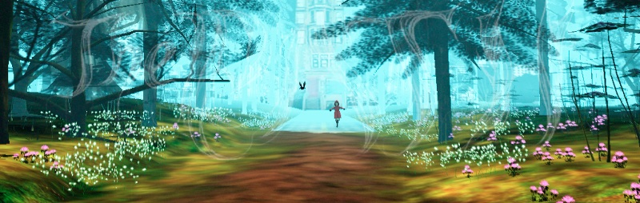

I don’t care if something is a “true game” or a non-game interactive experience. I do care if I got immersed with awe, curiosity or dread. Some time ago I wrote:

> (On finding your personal, traumatic wolf)  
> Will you head to a beacon to your own end  
> Or drink a poison so you can live again?  
> Will you watch your maker gasping his last breath  
> Or wake in the depths years after your death?  
> Will you sacrifice your love, childhood’s friend  
> Or flirt with a stranger amidst the fiery end?

Each line is from a game. To reduce the spoiler potential, here are these, in alphabetic order (with one extra): _Amnesia: The Dark Descent, Dear Esther, Firewatch, Life Is Strange, The Path, SOMA, The Stanley Parable, The Vanishing of Ethan Carter_.

Games below take from a few hours to 2–3 days, and won’t ruin your schedule. Unless you start playing a day before a deadline and get immersed.

### Games I recommend

#### The Path

An oniric (and occasionally nightmarish) game on a girl’s journey.

As in the _Red Little Riding Hood_, you need to reach to your grandmother’s house. The path is straight. But… the dark forest is much more interesting. There is a wolf. Your wolf.

Not a game, but certainly an unsettling psychological exploration.   
Story? Interpretation?  
Coming to age? Rites of passage? Irreversible trauma?  
Well, it’s up to you.

One of the first games in that genre (2009).

- **Recommend if**: You like exploring emotions. Like a forest. You are here to _experience_ rather than _achieve_.
- **It takes**: [3–6 h](https://howlongtobeat.com/game.php?id=10128). It took me around a day, not in one sitting, as it is a bit open-ended.

#### Life is Strange

It covers various social issues of socializing in college with its all shady parts (including a very realistic depiction of bullying, which moved me the most), in a mildly supernatural setting (but characters and social interactions feel very real ).

[Episode 1 is free](https://store.steampowered.com/app/319630/Life_is_Strange__Episode_1/) and takes ~3h. You can safely play it this Sunday, and yes, totally do so especially if you are not a gamer (many, many non-gamer friends of mine love it). No excuses! 4–5 aren’t free but are worth any price!

(There is a prequel **Before the Storm** and another story **LiS 2**, but more or less there is a consensus that there are not nearly as good as the original one.)

- **Recommend if**: just recommend. No ifs!
- **It takes:** [14–18 h](https://howlongtobeat.com/game.php?id=21702). It took me 2 days (_“while playing episode one let’s just download others…”_); missed a deadline but don’t regret it any tiny bit!

#### Vanishing of Ethan Carter

> “The Sleeper must not Sleep!”

There are puzzles. The game puzzles are simple. The story, as a puzzle.

It does not scare you, as **SOMA** or **Amnesia**. But… I liked the story unfold, with pieces coming together, and more and more things making sense in the retrospect (a bit in the spirit (_no pun intended!_) of **The Sixth Sense**).

- **Recommend if**: you like Lovecraftian stories, Amnesia, The Sixth Sense or just looking at the gorgeous autumn sunset.
- **It takes**: [4 h, apparently](https://howlongtobeat.com/game.php?id=21142). It took me something like 1.5 days (I was wandering a bit).

#### Dear Esther

> “I’ve begun my voyage in a paper boat without a bottom; I will fly to the moon in it. I have been folded along a crease in time, a weakness in the sheet of life. Now, you’ve settled on the opposite side of the paper to me; I can see your traces in the ink that soaks through the fibre, the pulped vegetation. When we become waterlogged, and the cage disintegrates, we will intermingle. When this paper aeroplane leaves the cliff edge, and carves parallel vapour trails in the dark, we will come together.”

The least a game of a game. You walk, through a path, no crossroads. Short, sad, and visually stunning (and poetic).

- **Recommend if**: are easily moved by visual scenery, appreciate sad poetry.
- **It takes**: [1.5 h](https://howlongtobeat.com/game.php?id=43743).

#### SOMA

> “I mean if we are able to save even a small piece of ourselves … why wouldn’t we do that?”

Something close to **Amnesia** (survival horror, scary because of atmosphere/story, not — gore) and a bit — to [**Bioshock**](https://en.wikipedia.org/wiki/BioShock) (not only superficially (underwater base), but in being densely story-driven and mocking some utopia).

X-risk, mind uploading, gray goo — nerd’s paradise. And while I am skeptical of _“games asking philosophical questions”_ (because they tend to be shallow, pretentious) or patronizing) this time I **felt** the questions I had been thinking about.

Also, kept getting flashbacks for the next few months or so. A really good bad trip.

Oh, some people recommend playing it without monster: [SOMA Mod Stops Monsters From Attacking, Improves The Game](https://kotaku.com/soma-mod-stops-monsters-from-attacking-makes-game-bett-1751216547). I think it is a good piece of advice — while there is some challenge in avoiding monsters (and the death screen is interesting on its own), it is a story, and hide-and-seek with monsters is a distraction.

- **Recommend if**: like **Amnesia** or are a transhumanist (especially one too optimistic about mind uploading). Can appreciate (and handle) a very grim and depressing mood.
- **It takes**: [9–11 h](https://howlongtobeat.com/game.php?id=43743).

#### Amnesia: The Dark Descent

> _Daniel:_ “It sure is dark in here.”  
> _Alexander:_ “Yes, and there is a good reason for it. But you can light the lamp now if you wish.”  
> _Daniel:_ “What’s the reason? For the darkness, that is”  
> _Alexander:_ “Stay close — be careful not to stray.”  
> _Daniel:_ “What’s the reason? Why is it so dark?”  
> _Alexander:_ “Pay attention, Daniel. It’s important that you keep going straight and make sure not to stray.”

When I first opened it, it asked me to dim lights in the room. I thought: _“oh, so pretentious!”_. Then, after not a long time, I turned the lights on. I was afraid.

When you are completely defenseless, it changes the dynamics, from someone who can defend (in a however clumsy way, vide **Alien vs Predator**) to a prey.

- **Recommend if**: if you like Lovecraftian stories, and being afraid (even if there is nothing around… but who knows what lurks in the darkness?).
- **It takes**: [8–10.5 h](https://howlongtobeat.com/game.php?id=440) (it took me a bit more, I guess 2 days).

There is [**Amnesia: A Machine for Pigs**](https://en.wikipedia.org/wiki/Amnesia:_A_Machine_for_Pigs), which is nice, but IMHO not as good as the original one (except for its… ending).

#### Firewatch

Too grim? Take some time off in the wilderness. Maybe not as ambitious or deep, no primordial monsters or curses. And at least you are not alone — you can talk via radio with someone you can trust.

- **Recommend if**: want something narrative, and be scared but just a bit.
- **It takes**: [4–5 h](https://howlongtobeat.com/game.php?id=43743)

#### The Stanley Parable

Or maybe the opposite — everything is too obvious, and if there are only two or three interpretations, it’s not enough. Maybe you want to challenge the narration?

In The Stanley Parable, it is full of self-references, and the fourth wall is broken so often you may wonder if it exists.

- **Recommend if**: you like meta; and enjoy playing the same game many times.
- **It takes**: [1.5–7 h](https://howlongtobeat.com/game.php?id=14083) (oh, you can rush to the end… but is it the end? is it the only end?)

### Remarks

When writing I found [HowLongToBeat.com](https://howlongtobeat.com/) for a play-time estimate. Sure, some games may take months (or years) of your life (e.g. [51–172 h for The Witcher 3](https://howlongtobeat.com/game.php?id=10270), for a comparison). I don’t have time for them either and prefer a short and intense experience, rather than spending too much time. (For a similar reason I watched all cinematics from **The Witcher 2 & 3**, so to enjoy it and make sure I won’t get tempted.)

Yes, I’ve heard about **Gone Home** and **Everybody’s Gone to the Rapture** (didn’t, play though). I kind of focused on the first-person perspective walking games, though I see some similar patterns in [**Limbo**](https://playdead.com/games/limbo/) (a gloomy platformer), [**Oxenfree**](https://store.steampowered.com/app/388880/Oxenfree/) (horror mystery; OK) and [**Kentucky Route Zero**](http://kentuckyroutezero.com/) (by answering you don’t state the facts, you create them; the narration is everything!).

And some interesting analysis, containing spoilers (don’t open, as it may close your open-ended experience): [SOMA, trans, and gender](https://genderterror.com/2015/11/09/soma-a-trans-simon-experience/) (mild spoilers) and [In-Depth Analysis for The Path](https://gamerdame.wordpress.com/2011/08/13/in-depth-analysis-for-the-path/) and [Investigating the story of The Vanishing of Ethan Carter](http://leaden.ru/2014/10/investigating-the-story-of-the-vanishing-of-ethan-carter-spoilers/) (major spoilers).

> Whenever you recommend me a game, it starts with: “you walk”.

I was told by my girlfriend. And she has a point. So, _would you kindly_ tell me what is the common pattern of the games you recommend?
