It seems that some artifacts generated by artificial neural networks are eerily similar to those created by our altered states of mind, be it dreams or thanks to psychedelics.

While mentioning psychedelics (and showing trippy computer-generated images) has some entertainment value, my motivation is different, as explained in [Exploring human vs machine learning (one blogpost at a time)](https://p.migdal.pl/2019/07/15/human-machine-learning-motivation.html):

> While each particular machine learning algorithm comes with its own artifacts and limitations, some issues are much broader. In fact, there are limitations of any learning process, machine or human alike. I think that it’s worth investigating these, as there is a lot of room for cross-pollination between machine learning and cognitive science.

Note that it will touch the subject of drugs (and deep learning). If you are uncomfortable with the topic, please don’t proceed any further.

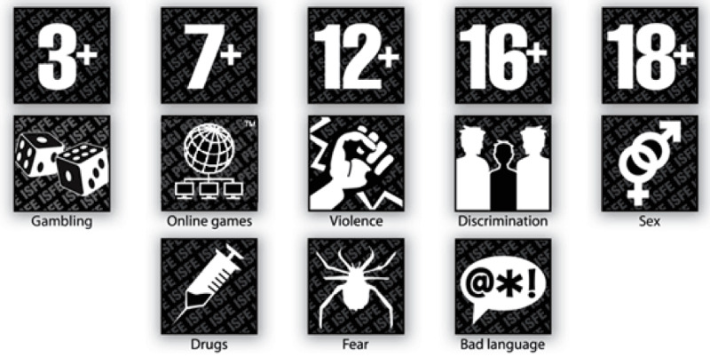

To set the right expectations: I invite you for a visual trip with some text blobs and link rabbit holes, rather than going deep into the topic. Embrace the (creative) chaos! :)

### Dreams and drugs

Most of you have had some night dreams. Some may have experienced other altered states of mind due to sleep deprivation and fever (e.g. [hypnagogic](https://en.wikipedia.org/wiki/Hypnagogia) and [hypnopompic](https://en.wikipedia.org/wiki/Hypnopompic) hallucinations), mystical visions, or substance (ab)use.

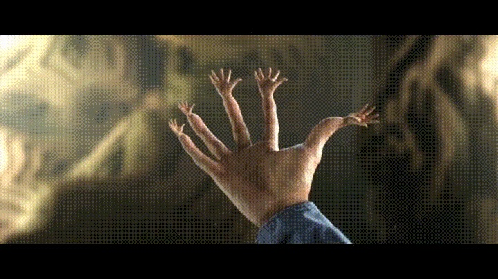

We see _“recursion is consciousness” theme._ Just a few moments before, Gandalf struggles against a shapeless form on darkness.

> Most deities appearing in LSD sessions fall into two rather sharply defined categories: the first group includes those that are associated with the forces of light and good; the second is comprised of deities of darkness and evil. — Stanislav Grof, Realms of Human Unconsciousness

But enough of bad trips, fights with supernatural powers (remember [Jacob wrestling with an angel](https://medium.com/@jeremyweate/jewish-prophetic-experience-and-entheogens-37d7d8b8b414)?). Though, many trips are less metaphysical and more visual:

> Quite frequently, the visual field is dominated by abstract geometric designs or architectural patterns that underlie all the dynamic color changes. The persons experiencing these ele­ments often describe them as interiors of gigantic temples, naves of incredibly beautiful Gothic cathedrals, cupolas of monumen­tal mosques, or decorations in Moorish palaces (“arabesques”). Sometimes these visions are compared with paintings of various abstract artists such as Piet Mondrian and Wassily Kandinski. On other occasions, the experiencers talk about phenomenal kalei­doscopic displays, magic sparkling fountains, and _jeux d’eau_ or majestic fireworks. — Stanislav Grof, Realms of Human Unconsciousness

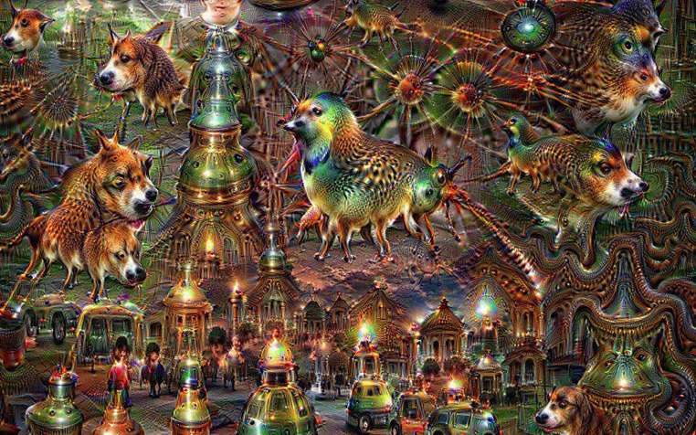

We see dogs, birds, and cats… everywhere!

Admire, explore and ask yourself a question:

> _What should I use:_ **_THC_**_,_ **_LSD_**_,_ **_DMT_**_?  
> A good_ **_GPU_**_!_

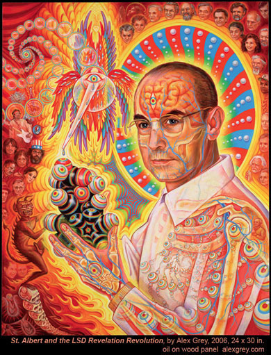

I mean, using a GPU (and TPUs) won’t be necessarily cheaper than other three-letter acronyms. But certainly is more inspiring!

How does it work? Crucially, these are not networks are not ones designed for creating such psychedelic images. Essentially, we are forcing a network to see [pareidolia](https://en.wikipedia.org/wiki/Pareidolia) (more on that below, in _“deep dreams are made of these”_). Are deep dreams similar in any meaningful way to tripy experiences? See [r/replications](https://www.reddit.com/r/replications/) and make your judgment.

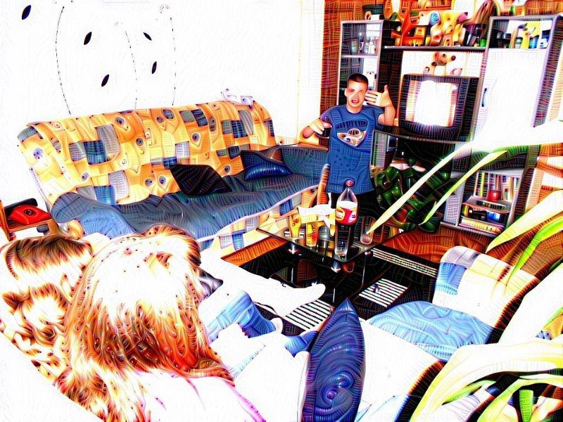

There are numerous “trip reports”, as well as a lot of graphics seemingly inspired by psychedelic experiences, e.g. [SuperHazed on DeviantArt](https://www.deviantart.com/superphazed) or [Spiritual Transformations I-II](https://www.fuw.edu.pl/~kostecki/spiritual_transformations/index.html) by Ryszard Kostecki.

I wanted to add that we cannot take a “screenshot” of what we see, inside our head. Well, that thing may chance as well. Here is an image reconstructed from fMRI scans:

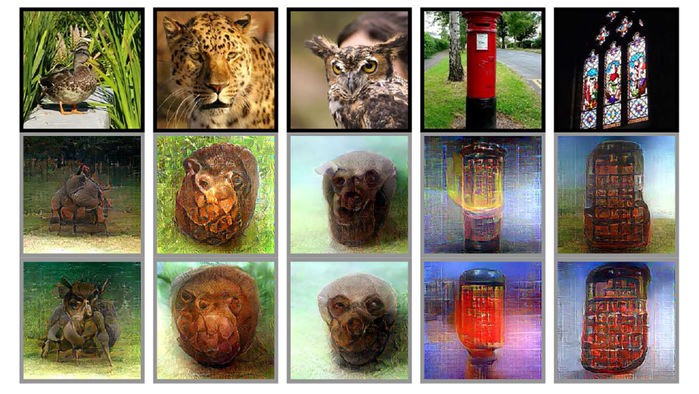

Speaking of what “what people have in their minds”, let’s focus on a stereotypical teenager’s vision ([see some drawings by CollegeHumor](http://www.collegehumor.com/post/6308305/porn-o-vision)). Here we go — [a Generative Adversarial Network for creating images (a wonderful overview)](https://blog.floydhub.com/gans-story-so-far/). But with one more knob — is a picture Safe Work Work or not.

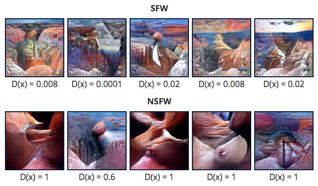

Also, sex in a fertile topic and deep learning is not an exception. If you look for a dataset “for a friend”, I visualized one ([was, well, covered by Vice Motherboard](https://www.vice.com/en_us/article/qv7bxw/machine-learning-map-reddit-sexual-fetish-kink-subreddits)). However, we can go beyond visualizing human bodies. Safer, you say? Well…

> The effect was that of a Cyclopean city of no architecture known to man or to human imagination, with vast aggregations of night-black masonry embodying monstrous perversions of geometrical laws and attaining the most grotesque extremes of sinister bizarrerie. — [At the Mountains of Madness](https://en.wikisource.org/wiki/At_the_Mountains_of_Madness) by H. P. Lovecraft

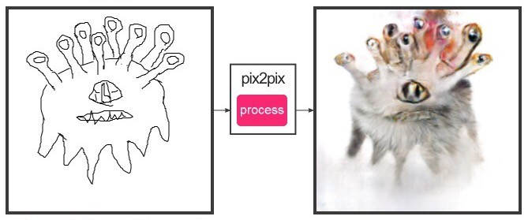

If you desire to summon eldritch abominations on your own, you can proceed the usual. Open an unintelligible script, use it, while being not aware of the consequences.

> JavaScript \[is\] black magic. Seeing how it is something designed to help us achieve good, with unintentional consequences beyond our comprehension, plus it can be used by evildoers to control, spy and mess with the innocent. — from [If Programming Languages were Religions](http://kokizzu.blogspot.com/2015/02/if-programming-languages-were-religions.html)

Proceed [Image-to-Image Demo](https://affinelayer.com/pixsrv/) by Christopher Hesse. If you want to play with your images, the fastest way would be using [DeepAI’s demos](https://deepai.org/ai-image-processing) (deep dreams, style transfer, and super-resolution).

### Deep dreams are made of these

And now let’s see machines getting high. [Feature visualization — how neural networks build up their understanding of images](https://distill.pub/2017/feature-visualization/) by Chris Olah et al. at [Distill](https://distill.pub/):

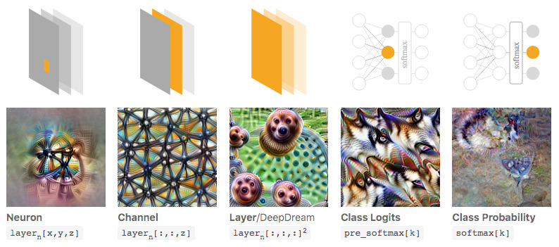

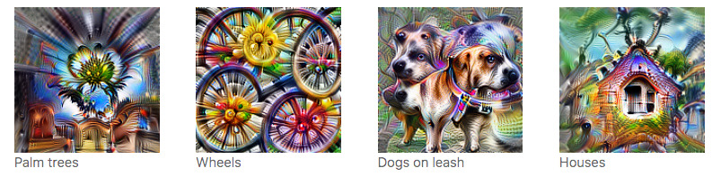

If you like to make some guessing game, there is [one based on AlexNet: Deep Quiz](http://www.robots.ox.ac.uk/~vgg/research/deepquiz/). Bear in mind is one of the older architectures, and artifacts are more pronounced. If you can tell what’s that maybe you are a machine (think of it is as some anti-captcha).

Or if you like to create some patterns on your own, check the [tensorflow/lucid](https://github.com/tensorflow/lucid) for creating dreams. See [Lucid: A Quick Tutorial](https://research.google.com/seedbank/seed/lucid_a_quick_tutorial) on Colab:

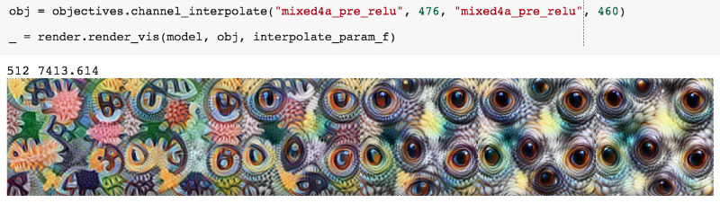

### Retrain your own neural networks

We don’t have two separate modes of train and evaluation. It means two things, one good and one bad:

- we learn all the time, and
- we learn all the time.

It is pretty uncontroversial that we can learn to recognize new objects (e.g. “this new face is Dave”). It may take more to learn new patterns. But about changing the low-level perception? Like colors or edges.

There are some optical illusions, that base on some temporary states of one’s mind. There is one that lasts much longer. Days, months or years.

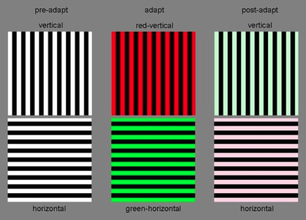

How long it lasts? For me, it was at least a few days (and possibly, to some slight extent still now, years later). The effect is subtle and was hardly noticeable in my everyday life. If you want to re(train) your own neural network, I’ve found this [McCollough Effect by Michael Bach](https://michaelbach.de/ot/col-McCollough/index.html) working for me. Read the disclaimer:

> If you follow the instructions below, you will change your brain for a prolonged time (up to month), in addition to simply remembering this. Proceed only if this is ok with you.

It seems to be reversible, with using the opposite patterns. A longer description, with references: [McCollough Effect — The Illusion Index](https://www.illusionsindex.org/ir/mccollough-effect). Also, if you want to investigate this effect if it works also for other patters (e.g. a grid of circles vs crosses), I would be delighted to collaborate!

EDIT: [https://github.com/stared/mccollough](https://github.com/stared/mccollough)

It’s work in progress; circle vs grid pattern produces a similar effect for me. If you want to add other patterns or continuous transitions, let me know.

### Final remarks

It’s based on talks with the same title, I gave a few times (neuroscience society, PlayAI conference). I trimmed it down significantly, to focus on some optical pattern-like phenomena. Even within vision, some topics deserve attention: pattern-based fears ([trypophobia](https://github.com/cytadela8/trypophobia), highly NSFL), optical illusions ([tweet](https://twitter.com/AliceProverbio/status/1050672406543486977), [paper](https://www.frontiersin.org/articles/10.3389/fpsyg.2018.00345/full)), uncanny valley. Oh, and actually there is already [Does AI have a dirty mind, too?](https://medium.com/@marekkcichy/does-ai-have-a-dirty-mind-too-6948430e4b2b) by [Marek K. Cichy](https://medium.com/u/5bf0995463b) and me.

If you want to read about psychedelics, and other altered states of mind, see:

- [Realms of the Human Unconscious: Observations from LSD Research](https://www.goodreads.com/book/show/196573.Realms_of_the_Human_Unconscious)  
  by Stanislav Grof ([my review here](https://www.goodreads.com/review/show/2772644842?book_show_action=true))
- [How Magic Mushrooms Rearrange Your Brain](https://www.wired.com/2014/10/magic-mushroom-brain/)—brain connection topology changes from fMRI scans
- [Brain scans reveal how LSD affects consciousness](https://www.nature.com/news/brain-scans-reveal-how-lsd-affects-consciousness-1.19727) — Nature
- [Shamanism: A Reader](https://www.goodreads.com/book/show/1596314.Shamanism), edited by Graham Harvey
- [Erowid: LSD-25](https://www.erowid.org/chemicals/lsd/lsd.shtml) and DMT, Salvia, psilocybin, etc (side [this beautiful visualization of Erowid](https://chemicalyouth.org/visualising-erowid/))
- On my reading list, there is also [Pihkal: A Chemical Love Story](https://www.amazon.com/Pihkal-Chemical-Story-Alexander-Shulgin/dp/0963009605/ref=as_li_ss_tl?ie=UTF8&qid=1470970245&sr=8-1&keywords=pihkal&linkCode=ll1&tag=slastacod-20&linkId=53494a31d89320b8466fd5124fd0e3d1) by Alexander&Ann Shulgin ([thanks to a Slate Star Codex review](https://slatestarcodex.com/2016/08/11/book-review-pihkal/)).
- [Octopuses given mood drug ‘ecstasy’ reveal genetic link to evolution of social behaviors in humans](https://phys.org/news/2018-09-octopuses-mood-drug-ecstasy-reveal.html)

> Participants ranked \[their psychedelic\] experiences as among the most meaningful in their lives, comparable to the birth of a child or the death of a parent. Two-thirds of the participants rated the psilocybin session among the top five most spiritually significant experiences of their lives; a third ranked it at the top. — from [The Trip Treatment](https://www.newyorker.com/magazine/2015/02/09/trip-treatment) by Michael Pollan , as referenced in [Why I Quit Tech and Became a Therapist](http://glench.com/WhyIQuitTechAndBecameATherapist/) by Glen Chiaccheri

The only drug I was on when writing this caffeine.

As a disclaimer: this article is not an encouragement to try any psychoactive substances or deep learning frameworks.
