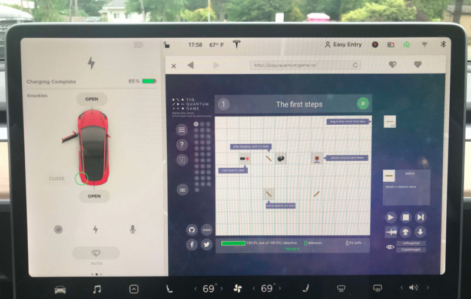
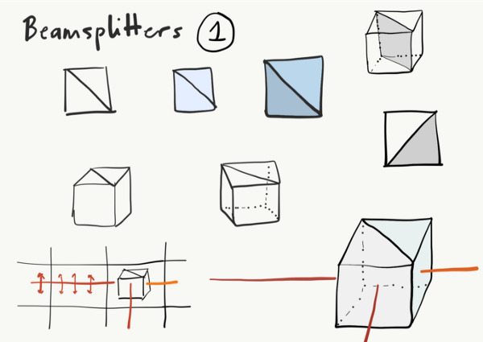
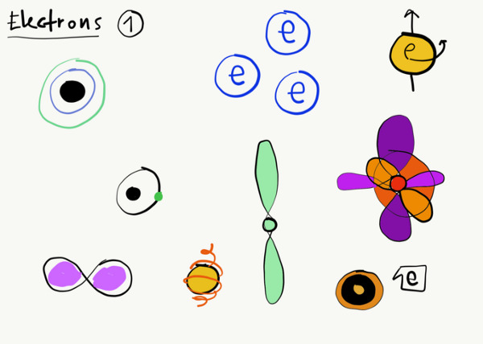

Did you play [Quantum Game with Photons](http://quantumgame.io/)?

It’s a puzzle game with photons, superposition and quantum measurement, right in your browser. With true quantum mechanics underneath!

Good news: there will be part 2. You may have noticed [an opening](https://forms.gle/fVQtyNMf3zWxREyAA) for the game. In short, we were invited by Artur Ekert and we will work late Aug — Nov at [CQT in Singapore](https://www.quantumlah.org/). The goal is simple:

> “All I want is the coolest quantum game in the known multiverse, please!” — Artur Ekert

It will be a drag&drop puzzle game. So, what’s coming in the new version?

- **More photons** (2 or 3) — so we can explore entanglement, Ekert protocol for quantum key distribution, a two-photon interference.
- **An electron or two** — so you can play with spin, singlet states, Bell pairs and so on.
- **A better interface**, especially for mobile devices.
- **More explanations** — interactive formula explorer, explorable explanations of quantum mechanics, photos from actual laboratories.
- **Level sharing** — so it will be easy to create and share both puzzles and experimental setups in quantum optics.

And more? Well, we have quite a few ideas. As in any creative process, we need to see what fits it. From tensor diagrams, through Bell inequality to Everett many-world interpretation. Or multiplayer, LaTeX quantum state visualization packet. Or NPM package for quantum optics. Or dedicated apps for iPhone and Android. Or an automatic level design with Generative Adversarial Networks.

At the same time, we really want to:

- **Fun to play, accessible** — so anyone interested in puzzle games can start their adventure. No need for a PhD in quantum physics!
- **Physics only** — all elements are physical: no Star Trek-like teleportation, no faster-than-light communication, no lasers you can see and hear in the empty space. We want to keep it weird and real at the same.
- **Learning as an optional side-effec**t — you can play purely for fun, but if you want, it will provide an opportunity to learn about light, wave physics, optics, and quantum mechanics.
- **Open source** — open for contributions, and reusable in other projects: games, didactic materials.

So, we go by matra of [the collaborative list of science-based games](https://github.com/stared/science-based-games-list):

> Actually playable:

> you can play them for fun, not “for classroom only”.

Tech-wise it will be JavaScript. We want to make sure it is accessible for people with various operating systems and devices.

Team-wise there are physicists, software engineers, graphic designers, and science communicators.

Stay tuned: follow us on [Facebook](https://www.facebook.com/quantumgameio/), [Twitter](https://twitter.com/QuantumGameIO) or [here](https://medium.com/quantum-photons).

Expect posts on the team, our inspirations, tech, and design choices, etc.
