Demons invaded Earth and ruined Doom HUD. Some alternative titles:

- A devilishly minimalistic style vs death by Candy Crush glitter.
- An immersive vs casual game.
- A dark journey vs demon piñata.

#### Impressions

Autumn 2019 I played **Doom 2016** for the first time, and immediately fell in love. Everything was exactly in place: from the pace and mechanics, through graphics and the atmosphere, to UI and style. The gameplay just felt right — dynamic as hell, encouraging rolling up your sleeves, and getting into visceral contact with the enemy. We had all the best from Doom 1&2 (no talk, all action) plus much more. It is a masterpiece on so many levels. In the last decade, the closest showing the rage of hell was the Painkiller series (which, IHMO, has the best concept of hell in all games). Samuel Hayden’s ambiguity is second only to G-Man from the Half-Life series, and in the same way, I got small shivers each time he talks.

When I opened pre-ordered **Doom Eternal**, on the release date, my feelings were… mixed (was I ripped off, and should I burst into tears?). I mean, the game is clearly polished, and there are quite a few things that make its combat dynamics nicer. Yet, I feel like it turned into a superhero button-smasher.

I can go in-depth on many aspects that made difference. For example, the big emphasis on platforming (it turns out that demons turned earth into a gym, with gymnastic bars and climbing walls everywhere). Everything was made more ‘epic’: your flying castles (a safe place to go breaks the atmosphere of danger), all bombastic talks (e.g. with a specter Thor and Purifier-Selendis), and the overall background story looks more like a creative writing exercise (or was it [generated by GPT-2](https://www.gwern.net/GPT-2)? then actually I hold my reservations). Also, as a person who played the original Doom (in 1993, when I was 7 years old) find it blasphemy to show the third-view perspective revealing the Doomguy’s face. This person should be… you.

But all of it is bleak when you compare that to XPs, 1UPs, and Candy Crush-esque colors. So, I will focus on showing screenshots, side by side, with the focus on UI differences. It won’t be fair

#### A few more of my biases

To be clear, while I do like the challenge, I care even more about immersion. [I am totally into atmospheric “walk simulators” like Amnesia or SOMA](https://medium.com/@pmigdal/games-in-which-you-walk-and-get-immersed-a80ad2bcfa7f). I couldn’t play most “free to play” games if they instead paid to play them. With a few exceptions (e.g. The Dark Knight, Dr. Strange), I don’t like superhero movies. I did enjoy Diablo 2, but after seeing the graphics (and cinematics) of Diablo 3 I never ever got tempted to play this.

### In-game screenshots side-by-side

Since at its core, most of the mechanics are the same, we can literally compare equivalent features. The most striking is the difference between the so-called HUDs (Heads Up Display — indicators of health, armor, ammunition, etc):

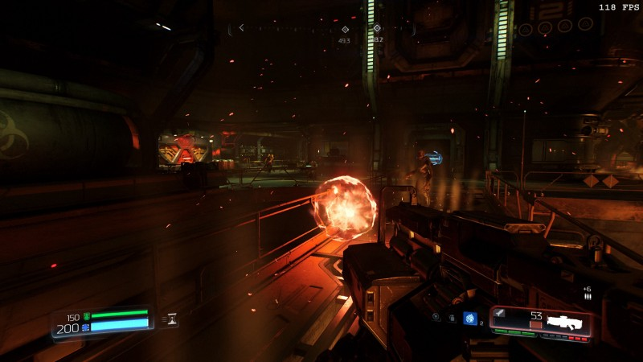
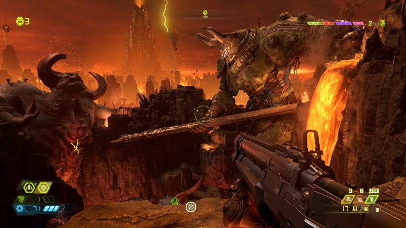

From now on, Doom 2016 is on the left, while Doom Eternal is on the right. But I am sure you won’t mistake any.

#### It’s in the beginnings

The intro screens are an underappreciated part — usually devoted to seizure warnings or publisher’s commercials. Yet, sometimes they manage to set the mood.

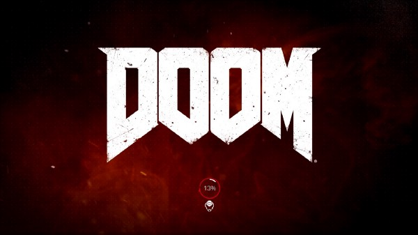
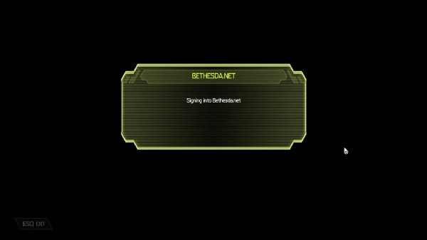

And then the main menu. In my opinion, Doom 2016 can make adverts more stylish than Doom Eternal anything else.

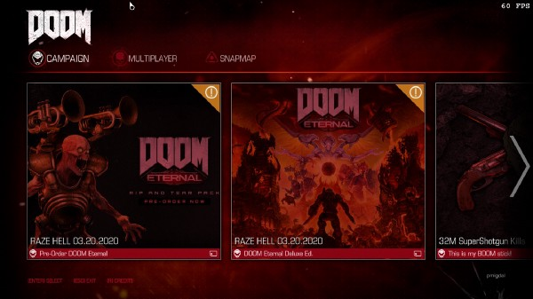
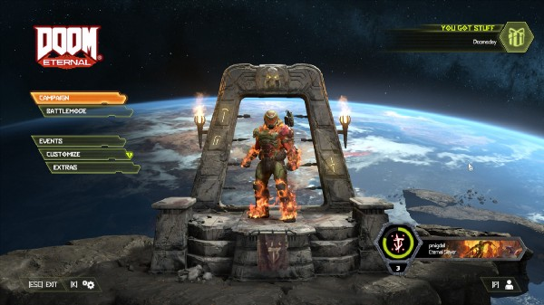

#### Level selection & loading

While the difference is not huge, you can see the style — toned vs arcade-like.

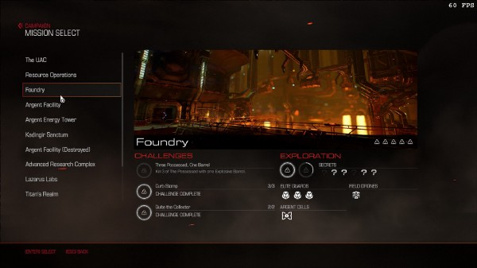
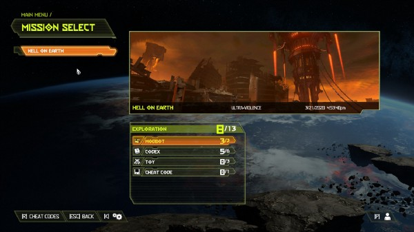

But once we load a level, the difference is profound: immersing us into the lore, or teaching keyboard shortcuts: mood vs mechanics.

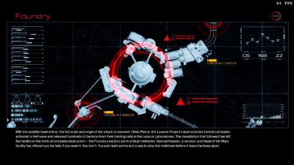

#### Map & challenges

Look at the color and items. Which one is more stylish?

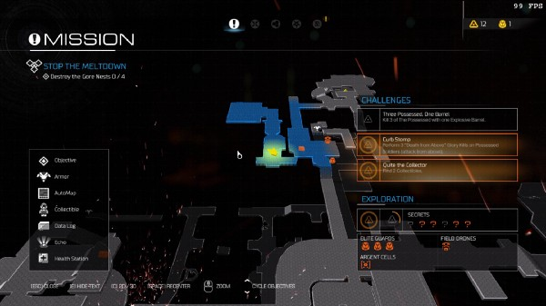
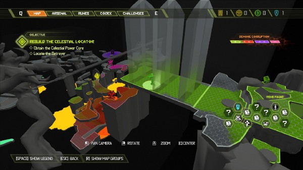

In Doom 16 we have challenges on the same screen. Let’s see how do they look in Doom Eternal:

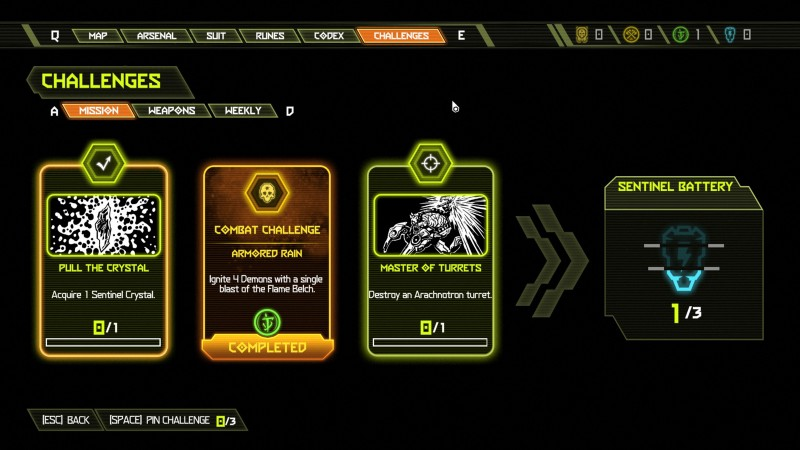

#### Upgrades

Here are the other screens, more for the sake of completeness than anything else. Since many screens have their direct counterparts, this job is easier than ever.

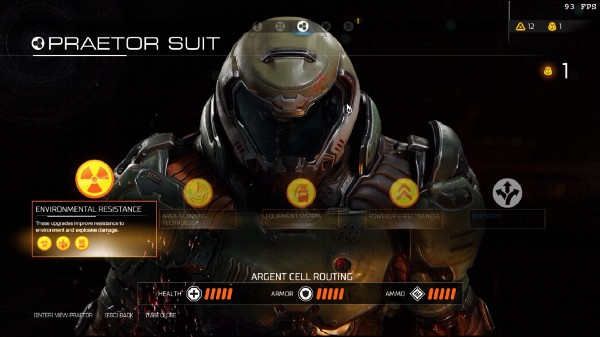
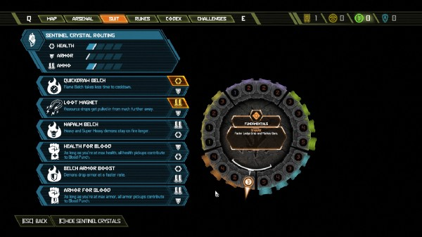

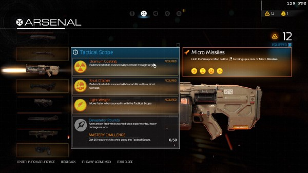
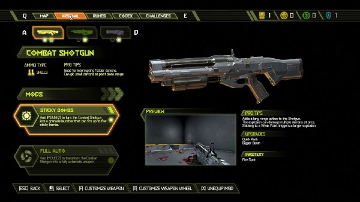

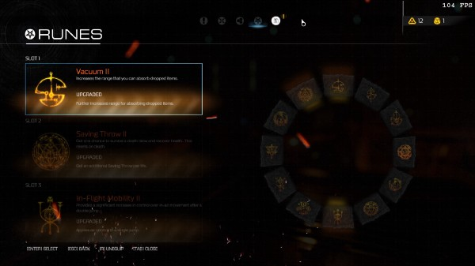
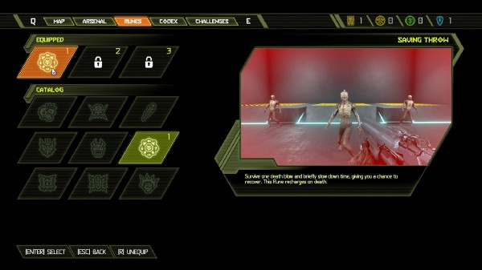

Though I must admit: I do like animations showing items in use (I don’t like non-game graphics, though). I know this approach from StarCtaft 2 (see [Zergling upgrade options](https://youtu.be/5mfxhctDD7c?t=404)).

#### Monster encyclopedia

UI is one thing, but even graphics went cartoony. What I do like though, is that enemies do have weak spots. It was explored to some minimal extent in Doom 2016, but in Doom Eternal, it makes fights much more interesting.

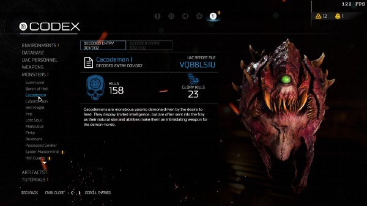
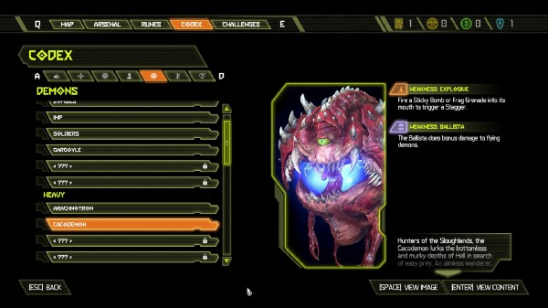

#### Pickups

In Doom 2016 you acquire weapons by prying it from cold bodies of fallen defenders. Or at least, when they rest in cases, from which you pick it with due solemnity.

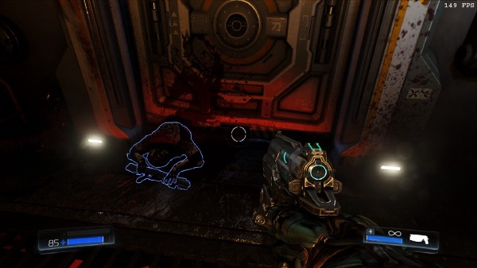
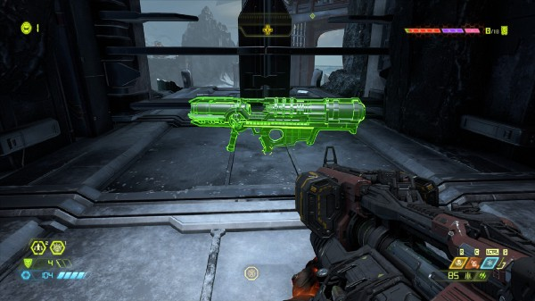

I DID think that in Doom 2016 life, armor and ammo dropped by enemies was… well, not realistic (do enemies have some ammunition sacks in their bellies?), but after getting used to the convention — immersive nonetheless.

Now, by comparison, I consider the faded yellow and blue to be a masterpiece of style, compared to, as previously advertised, _demon piñata_.

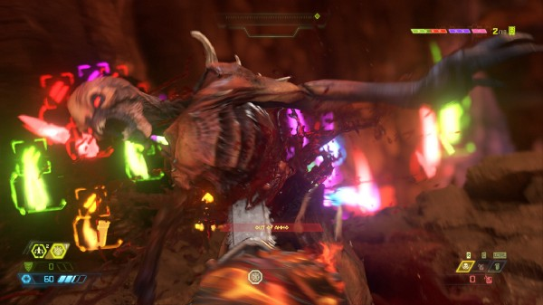

#### Secrets and collectible dolls

Doom 2016 did have easter eggs and cute moments. You can find action figures of Doom characters. At first, there were in-game graphics, and even the character’s interactions added nostalgic touch. In Doom Eternal, well, it is closer to the Mario Bros style.

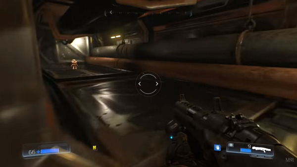
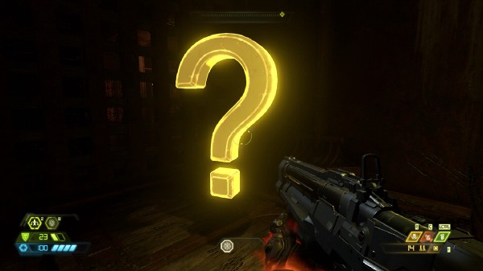
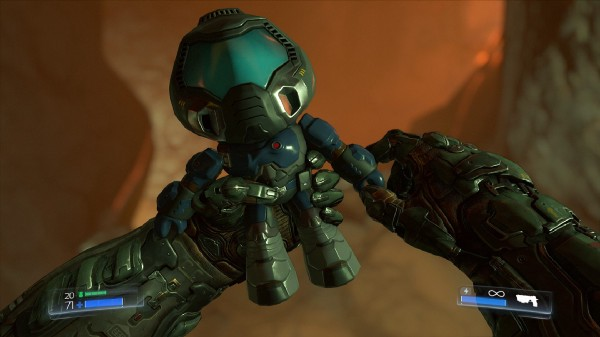
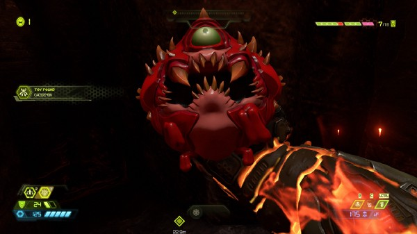

### Conclusion

Doom Eternal is a game consistently different in style than Doom 2016. Instead of stylish, immersive minimalism, there is everything added that can be epic (which may make it harder to suspend disbelief) and everything shouts “it is a game!” ad nauseam.

Yes, you still get as much demonic exposure and savage gore. To some extend I find the dissonance between candy graphics with hue set to max vs internal organs ripped and tore to be similar to that of the Happy Tree Friends… but without due irony.

While I personally dislike the new style, I am sure that some people like it. To make it clear, I still plan to play it, as for a casual challenge it is fun. Yet, I need to rip and tear the dreams of playing it in one or two fully immersive sittings — at least for me, it is not a game for that kind of experience.

#### Some other people

While a lot of people praise the game mechanics improvements, I didn’t see nearly as much appreciation for colorful UI. On [Reddit r/doom](http://reddit.com/r/doom) there are quite a few vocal posts, sharing a similar sentiment:

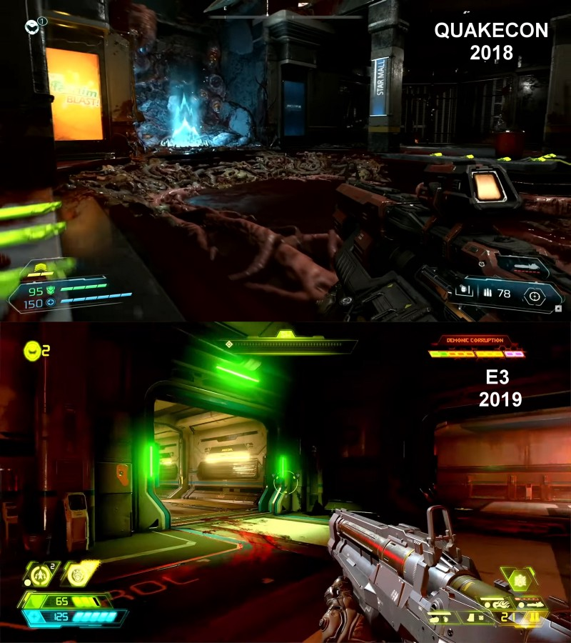

#### Further reading

Minimalism was behind the original Doom. There are only a few weapons. Even though scoreboards were ubiquitous at that time, they were removed. I really recommend the Master of Doom, a book as fast-paced as the game itself.

- [Masters of Doom: How Two Guys Created an Empire and Transformed Pop Culture](https://en.wikipedia.org/wiki/Masters_of_Doom)
- [Game UI Faceoff: Doom vs Dishonored 2](https://medium.com/@a_kill_/game-ui-faceoff-doom-vs-dishonored-2-4c0c90ed7e54)
- [DOOM: Eternal Devs Say The Tawdry UI Is Supposed To Be Big, Bold And Loud](https://www.oneangrygamer.net/2019/06/doom-eternal-devs-say-the-gawky-ui-is-supposed-to-be-big-bold-and-loud/86823/)

#### If not Doom, am I doomed, eternally?

If you like the more immersive world, go for [Ori and the Will of the Wisps](https://store.steampowered.com/app/1057090/Ori_and_the_Will_of_the_Wisps/) (which keeps the style, challenge level, and emotional immersion of the Blind Forest), or for shooters — there is a beautiful remake of Half-Life: [Black Mesa](https://store.steampowered.com/app/362890/Black_Mesa/) with one best ray-tracing in games up to date (Xen is a hazardous excursion, a visual delight). If you bought an RTX graphics card, it won’t come to waste.

#### Hope

I know that hope is not the best word when it comes to doom (of a demonic invasion, or COVID pandemics) — but I really hope the next expansion will be back to the minimalistic style.

And you — what is your impression? Or maybe you got some insights into why did it got redesigned visually?

Or at least you can choose the unicorn skin and appreciate the contrast:
