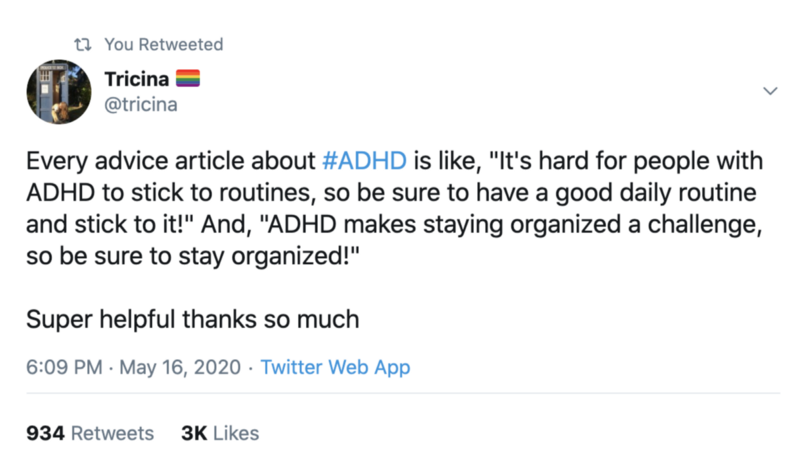
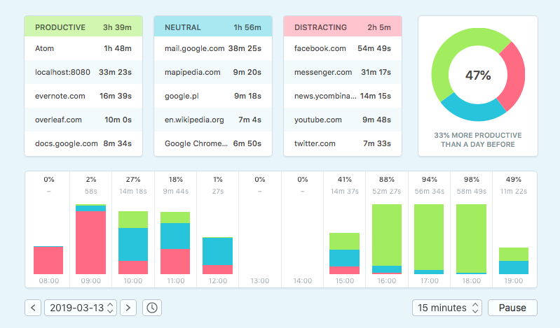
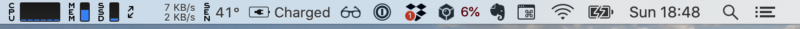
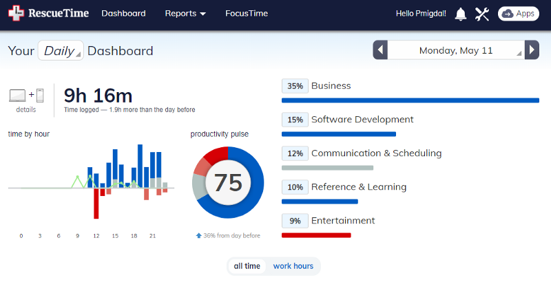
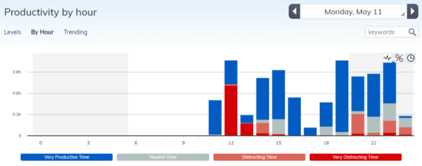
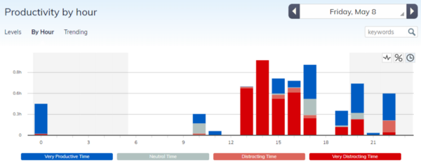
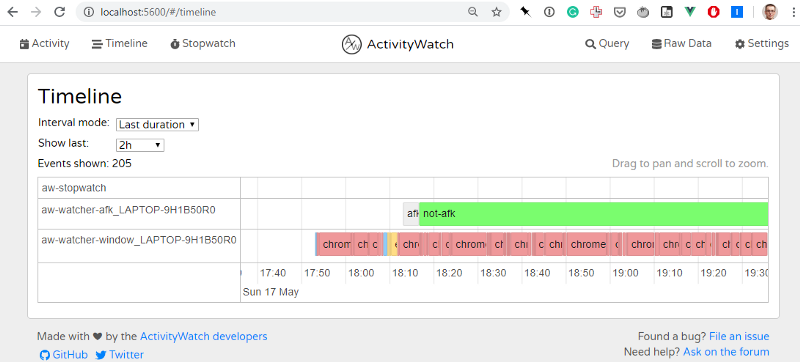
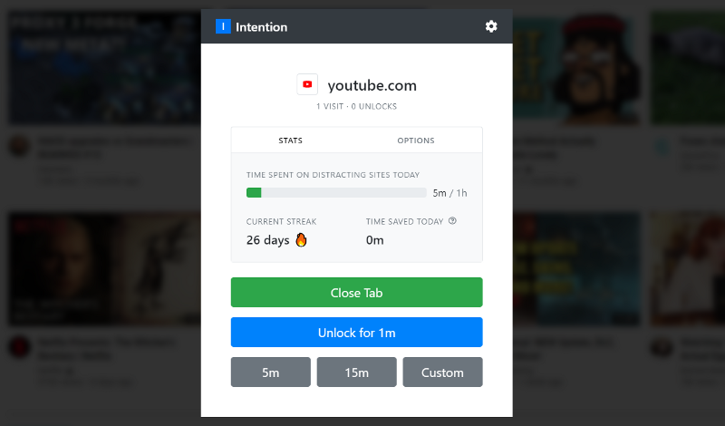
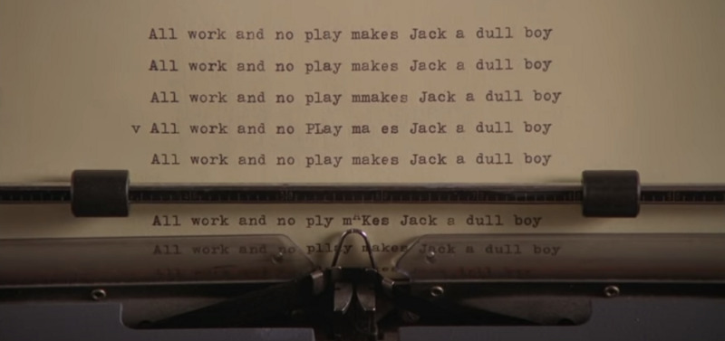
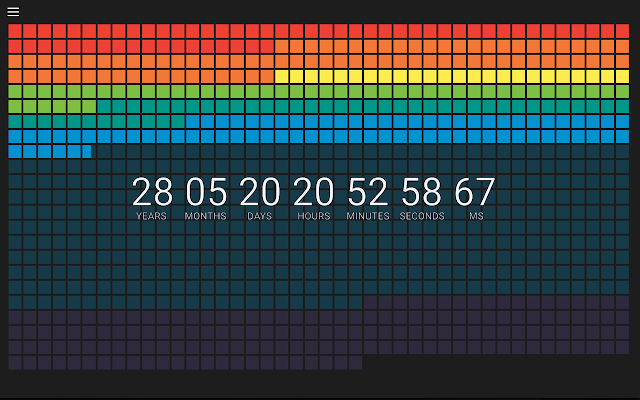

_A few tips on automatic time tracking, especially for people with ADHD: how to get immediate feedback, for actions, not guilt._

**tl;dr**: Qbserve when I was on macOS, now RescueTime + Custom New URL Tab (Chrome extension) pointing its report, so I get immediate feedback on my productivity (motivates me to keep moving), or the depth of my slacking (motivates me to start working). Plus I use Intention, for web browsing.

I cannot stress enough the word _immediate_. Delayed reports (after a week, after a day, or whenever I check) sure give a bit of reality-check and insight on what to change (usually only the first time) but were not useful for actually implementing these changes. (I have ADHD if that matters. For some people insight might be enough.)

> What then is time? If no one asks me, I know what it is. If I wish to explain it to him who asks, I do not know. — Augustine of Hippo

Even though I have studied physics, time remains a mystery to me. I know I cannot keep track of time. I need some kind of “prosthetics” for my daily functioning, to even remotely stay on track. It is why, since I was 15 or so, I always wear a watch (no, a smartphone in my pocket is not enough). If I don’t have a watch, I feel confused.

And how about work? Freelancing is great and gives me the freedom and flexibility I desire. However, it comes as a cost of the lack of external structure, to get work started and keep it on track. Sometimes all it takes checking a single (and relevant!) link, and 2h are gone (after a rabbit hole dive).

### What does work (for me)

There are a few easy things:

- my watch (Fitbit, motivates me to walk more and sleep more; enough to charge once a week),
- Google calendar (event not there = event does not exist),
- alarms for everything (I need to get ready for a meeting in the evening? I set an alarm).

Let me share what helped me with self-spying, that’s to say — time tracking. I need two things:

- automatic time tracking (cannot require extra actions from my side)
- real-time feedback on the display

I cannot overemphasize the latter. If I get a summary after a week, or even — at the end of a day, it will guilt-trip me (at which I excel), but it won’t be helpful. I will blame myself and keep on slacking/sinning.

[**What's worse: Catholic guilt or Jewish guilt? | The Tylt**  
\_Catholics are famous for guilt-they're born with original sin, taught that "impure thoughts" are shameful and wrong…\_thetylt.com](https://thetylt.com/culture/catholic-guilt-or-jewish-guilt "https://thetylt.com/culture/catholic-guilt-or-jewish-guilt")

What I need is an always-watching deity that also provides immediate feedback. (“_There is no ADHD when it comes to video games._” — we strive on fast, objective& actionable feedback!)

#### Qbserve (macOS)

I had my on-and-offs with many pieces of software. Until I saw [Qbserve](https://qotoqot.com/qbserve/):

What is even more important, is the always-watching-cube in the taskbar, displaying my productivity score (the one with 6%):

It looks so tiny, but for me, it was a game-changer:

- it is persistent and does not require anything to click it,
- when I want to check my stats, they are one click away.

When I see it is lowish, I am motivated to start working, when it is high — motivated to continue (for reference, 6% is very low; but I didn’t use this laptop for work the given day).

#### RescueTime + Custom New URL Tab

However, in Dec 2019 I brought a new laptop, this time with Windows. To my surprise, it was easy to set up a dev environment (Anaconda, Node, and VSCode work almost the same). Another thing started to be a challenge: how to be productive, since I cannot use Qbserve AND [a powerful graphics card](https://www.userbenchmark.com/UserRun/22715050) has other good uses than deep learning? I installed [RescueTime](http://rescuetime.com/).

It tracks reasonably well but misses one core feature — real-time feedback. That is, I know I can see reports at wish, but I would love to get frequent feedback. It cannot be conditional on my consciously checking it.

I looked for extensions so that I would see it on the taskbar, but to no avail. However, then it clicked. I used some extensions to motivate myself with new tabs: [Mortality New Tab](https://chrome.google.com/webstore/detail/mortality-new-tab/eeedcpdcehnikgkhbobmkjcipjhlbmpn) (more on that in the “extra”) or a less morbid one: [Momentum](https://chrome.google.com/webstore/detail/momentum/laookkfknpbbblfpciffpaejjkokdgca?hl=en). Why not setting a new tab to RescueTime directly?

So, I installed [Custom New URL Tab](https://chrome.google.com/webstore/detail/custom-new-tab-url/mmjbdbjnoablegbkcklggeknkfcjkjia?hl=en) Chrome extension and set it to [https://www.rescuetime.com/browse/productivity/by/hour/](https://www.rescuetime.com/browse/productivity/by/hour/).

Now each time I open a new tab (which I do all the time) I get a reality check. I more or less know how I procrastinate a given day, so I don’t need a summary of it. A summary of time is invaluable, though. A small note: the default view is at [https://www.rescuetime.com/dashboard](https://www.rescuetime.com/dashboard).

#### ActivityWatch + Custom New URL Tab

If you think that I underestimate the government power to sabotage me, you underestimate my ability to self-sabotage myself. However, if you prefer an open-source (and much more privacy-focused) alternative, there is [ActivityWatch](https://activitywatch.net/), that would work with the same URL tab redirect, this [http://localhost:5600/#/timeline](http://localhost:5600/#/timeline)

The interface is slightly less polished (and, unfortunately, I experience a delay between opening it and getting a chart), but the tracking works. Since it is [in Vue I love](https://github.com/Quantum-Game/), one day I might modify it to my needs.

#### Intention

There is one, very recent, plugin I use on all machines: [Intention](https://www.getintention.com/), I learned from [an HN thread](https://news.ycombinator.com/item?id=22936742). (I used it on top of Qbserve / Rescue Time, not instead of it!) It only works for tabs, but since it is my main source of distractions (“_just one more video_”, “_just one more comment_”, etc), it matters.

Breaks are crucial. My most productive times were ones where I:

- worked hard on a single project,
- took intensive but time-limited breaks.

The best time ever was in high school while writing a mathematical paper and taking breaks with a Timeshock game (a pinboard, no storyline). We all know that no breaks is bad:

The problem is when I drift, and instead of a refreshing 15 min, it is a 2h rabbit hole journey, eating not only my time but also attention. But most of the current software does not address that.

- I use social media after midnight, and it does not stop me then but cuts the global limit for the next day.
- There is a nasty surprise when an app kicks me out, with no warning. It is so unpleasant (especially when I am in the middle of writing a long comment) that it may prompt be to uninstall it.
- Too strict limits. Sometimes I know that a given day I need more social media.

With Intention I:

- know how much of my time is spent on distractions,
- decide how much time I need,
- I see the countdown (so I know if I need to wrap-up a reply, or if it makes sense to start writing a new one),
- it automatically blocks these sites,
- yet, it distinguishes between “normal use” of YouTube and e.g. using it for creating a workshop on deep learning (looking for video abstract of recent papers).

### What doesn't work (for me)

I use [Toggl](https://www.toggle.com/) for time tracking for projects when I am paid by the hour (minority). I tried to use it for other projects, and sometimes it makes it easier to stay on track. However, I often forgot to switch it on.

There are a few plugins (e.g. ColdTurkey) that are “too nuclear”. Being halted in the middle of writing a reply (on Facebook or Hacker News), with no prior warning, left me disturbed. Even worse, when I used it for my WORK stuff, in [data science](https://p.migdal.pl/) or [Quantum Game](https://quantumgame.io/).

I have my on-and-offs with Pomodoro, but it does not work on a consistent basis, at least — not when self-applied. There was not a single app I was able to use more for more than a few days. Often, I had a problem with starting or restarting. Pomodoro worked when someone else was controlling time (or we took turns, and I knew others depended on that as well), but not for solo work.

**Side note**: why do ALL time-tracking pieces of software assume that the day starts at midnight? (Midnight does not seem to be anywhere near to the average of sleep time.)

### Some remarks

I hope it inspired you a bit to track time. If it inspired you, great — no matter if you have ADHD or not. Of course, it is up to you what you consider a valuable time, and what a distraction. We need to admit that creative work pretty much needs a balance between random pursuits and inspirations, and focus to get something done. Also, rest is something different than a distraction. While I procrastinate a lot I am slowly learning how to rest (e.g. a revolutionary idea of having a day a wee

To make it clear, such time-tracking helped me but is far for solving my problems. Unlike the topic of [dating, where I went from clueless to fairly competent](https://p.migdal.pl/2017/07/23/dating-for-nerds.html), when it comes to time organization I went from clueless to slightly less clueless.

If you struggle with time organization, I recommend [How to ADHD Youtube channel](https://www.youtube.com/watch?v=cx13a2-unjE) and [Driven to Distraction: Recognizing and Coping with Attention Deficit Disorder](https://www.amazon.com/Driven-Distraction-Revised-Recognizing-Attention/dp/0307743152) book by Edward Hallowell & John Ratey. The term “prosthetic” comes from their book, in which they compare ADHD to be short-sighted. Wearing glasses or lenses is an acceptable solution, and people are not pushed to “_just squint their eyes harder_”.

I thank Wojciech Jabłoński for bugging me to write it to write “ADHD tech stack”; thanks Anna Karpiuk and [Sarah Martin,](https://medium.com/u/39462454f46a) for remarks on the draft. It started as [a Hacker News comment](https://news.ycombinator.com/item?id=22854491).

If there is a need, I am happy to write on my TODO list with Evernote. I find it more useful than typical TODO apps, as it is more in the line of the Bullet Journal: if I don’t do a task, it is gone unless I take a conscious effort to write it down again.

#### Extra: Mortality New Tab

A close friend of mine showed me his display, with a rectangle in the background.

Asked me if it is big. I said it is small.

> Well, it is 365 x 100 pixels, and there are not as many days in your life. Think about every day, and if you spend it in a way that matters.

My desktop is cluttered, so I rarely see it. But for a few years I have been seeing with each new tab ([Mortality — New Tab](https://chrome.google.com/webstore/detail/mortality-new-tab/eeedcpdcehnikgkhbobmkjcipjhlbmpn)):

It is a modern-day “_memento mori_”. Quite ironically, it motivated me to live to the fullest. With each new tab, I asked myself “_Is opening this website the best thing I can do with this piece of time?_”. It didn’t hold me for entertainment; it held me from making time pass through my fingers, unintentionally.
