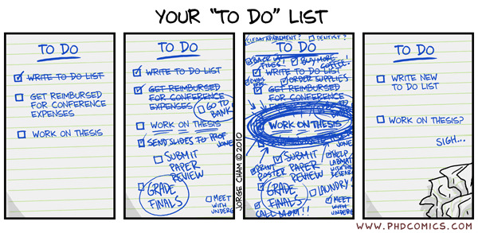
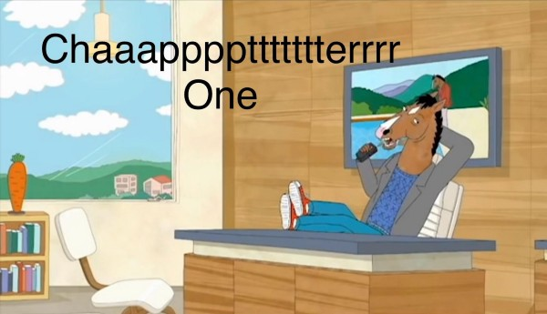
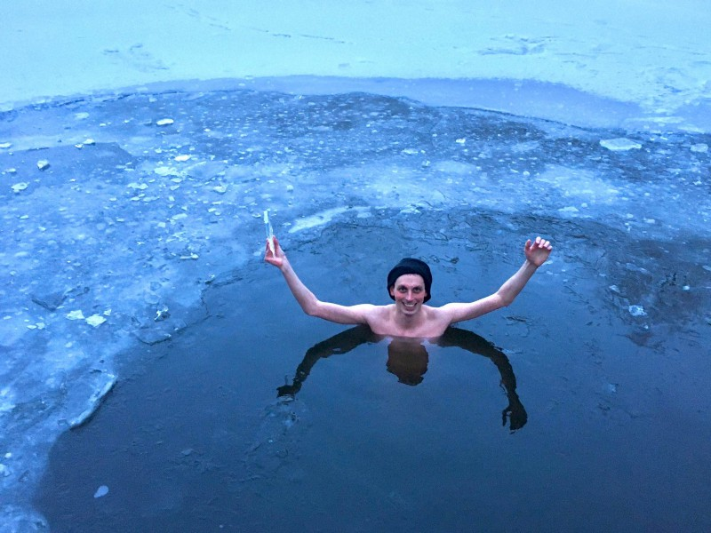

When a deer sees an incoming car, it freezes. For us, it looks stupid. But for the deer, this instinctive reaction seems to be the best. And it would be the best reaction if the car were a predator: too big to fight, too fast to outrun. By freezing it hopes that the beast fails to spot it, or gets distracted.

Yet, the car isn’t a predator. And an otherwise rational “freeze” response puts our dear deer’s life in danger, and at the driver’s reflex mercy.

Fight, flight, and freeze are fear responses. All of these responses make sense and can save our lives. I bet they saved your physical health or even life. Maybe even it saved you from a car — as you froze before entering a road, or you jumped away in time.

Yet, there are circumstances, in which these reactions are maladaptive. In this blog post, I leave physical danger aside and explore fear responses related to processing emotions and body sensations.

### Projects

From a distance, procrastination looks like a time management problem. There is growing evidence that it is rather an emotional management problem — a flight response. Instead of facing the problem, we evade it. And how do other fear responses work? Here we go:

- FIGHT: last-minute deadline crunch (“I will never surrender!”)
- FLIGHT: procrastination (“let’s keep it at a temporal distance!”)
- FREEZE: staring at the “chapter 1” of an unwritten report, piece of code, or email

{ class=width-max-half }

{ class=width-max-half }

> Flight and freeze at their best. From [PhD Comics](http://phdcomics.com/comics/archive.php?comicid=1350) and BoJack Horseman.

If procrastination is a fear response, guilt-tripping is not helpful. Self-flagellation intensifies the problem. Fighting with procrastination, if works, will bring you to the fight or freeze zone (as the underlying fear is still there). Self-compassion may help, as it reduces the root cause.

Identifying the source of fear is important. What are we afraid of — disappointing others, disappointing ourselves (e.g. due to perfectionism), or maybe it reminds us of similar tasks which we failed, etc. I was horrified to realize that sometimes activities as trivial as “send an official paper letter” evoke a PTSD-like panic reaction.

- [Why Is It So Hard to Do Something That Should Be Easy?](https://www.youtube.com/watch?v=Uo08uS904Rg&ab_channel=HowtoADHD) — How to ADHD video by Jessica McCabe and Brendan Mahan on “the wall of awful” metaphor (it directly inspired this section, and maybe the whole blog post in general)
- [Negative Emotions Today Predict Procrastination Tomorrow](https://www.psychologytoday.com/us/blog/dont-delay/202003/negative-emotions-today-predict-procrastination-tomorrow) — Psychology Today
- [You Procrastinate Because Of Emotions, Not Laziness. Regulate Them To Stop Procrastinating!](https://cognitiontoday.com/you-procrastinate-because-of-emotions-not-laziness-regulate-them-to-stop-procrastinating/)
- [ADHD tech stack: auto time tracking](https://p.migdal.pl/blog/2020/05/adhd-tech-stack-auto-time-tracking/) — my text on practical tools

### Attachment style

What are you afraid more of — loneliness or being in chains? Do you under- or overreact? What annoys you more: a partner being unresponsive, or too pushy and controlling?

- FIGHT: chasing and checking (anxious attachment style)
- FLIGHT: needing space, avoiding difficult subjects, ghosting (avoidant-dismissive attachment style)
- FREEZE: learned helplessness, hopelessness, or depression

 by Charisma on Command](./02.jpg)

As we all know, there is the Fountain of (Relationship) Life, secure attachment style. Feeling secure enough that we are fine with the ups and downs of relationships — reacting, but not overreacting. It is not easy, as a combination of our wiring, upbringing, and the current situation is likely to head us in one (or more) unhealthy directions. Sure, we have our inclinations — but the secure attachment style is a direction for growth.

This idea is close to non-neediness — to be self-sufficient enough that we don’t put our self-esteem in other hands. It means being OK with hearing “no”. We can be interested in someone but don’t need to chase. If we need space, we can calmly spell out our boundaries, but not run preemptively. And if the boundaries are broken, we can walk away.

- [What Is Your Attachment Style?](https://www.youtube.com/watch?v=2s9ACDMcpjA&ab_channel=TheSchoolofLife) — The School of Life video
- [“Models — How to Attract Women Through Honesty”](https://www.goodreads.com/book/show/12633800-models) by [Mark Manson](https://medium.com/u/db77b01f3f54), which I recommend regardless of your gender, orientation, or even if you are dating or not

### Body sensations

You accidentally hit your finger with a hammer. What’s your first reaction? And then: what do you do next? Do you try to resist pain, talk with someone to shift focus, or try hard to not feel it at all?

- FIGHT: grit one’s teeth and resist
- FLIGHT: distracting ourselves
- FREEZE: cutting ties with a body part / dissociating

There is nothing bad in dropping a swear word (in Poland, we traditionally [use one beginning with “k”](https://www.quora.com/What-does-Kurwa-mean-when-translated-from-Polish-to-English)). But once you know what’s going on, and know that your body is not in a state that requires immediate action, a fear-like response won’t help.

Next time try to… focus on the sensation. In a mindfulness way, observing and experiencing, but not judging. It won’t make the pain disappear, but it will make it less troublesome.

I don’t recommend hitting yourself with a hammer — neither healthy nor safe! I do recommend experimenting with other stimuli and stressors: tired muscles after an exercise, burning sensation from chili peppers, the heat of sauna — to name a few.

Personally, I do ice swimming. I started it in Nov 2020. Had I started it earlier — I would have gone in the “resist!” mode, proving to myself (if not others) how much cold can I bear. It didn’t save me from another fear reaction, though. During my second time in the water, I got drawn into a conversation. Instead of spending 2–3 minutes (as planned), I spent 12 minutes. Sure, I spent longer, but by fleeing from the sensation. A few weeks later I met a skinny woman, who just started ice swimming, yet was able to stay 15 min. First, I thought that she has superhuman mind & body control skills. Later, I learned that she is dissociated from the body — a common pattern for nerds, who had fled from their flesh to their heads.

There is a different approach — embracing the sensation of cold. I like to call it “mindfulness, between the two states of water”. Such openness goes beyond our subjective discomfort. We need to open our blood vessels to warm our hands and feet. In some sense, we need to tell our body that we are not in danger, everything is under control, and we have well enough heat to keep all of our parts warm & happy. And staying long enough that I want to go, but short enough that I don’t want to flee.

> “If you are at war with yourself, you will always lose” — as Stefan, my ice swimming mentor, keeps saying.

### Emotions

Similarly as with our body — what do you do with difficult emotions? From small conflicts and frustrations to deep wounds from unsatisfied childhood needs, worst traumas, and feelings that bother you on a daily basis?

- FIGHT: anger / pushing
- FLIGHT: distracting oneself
- FREEZE: numbness, depression, learned helplessness

It took me a lot of time that my intellectualism and objectivity were a flight response. Instead of addressing the problem, I avoided it, by distancing it from myself. It was not (as I claimed, and believed) a more advanced, rational approach. Sure, rational analysis helps (here I agree with stoics) — especially in frameworks such as [Nonviolent Communication by Marshall Rosenberg](https://www.goodreads.com/book/show/26203640-nonviolent-communication), which combines emotions with objectivity (the book is wonderful; for a teaser, I recommend [How to Deliver Constructive Feedback in Difficult Situations](https://medium.com/s/please-advise/the-essential-guide-to-difficult-conversations-41f736e63ccf)). If we subtract emotions — it is a flight or freeze response, and it is not helpful in the long run.

Processing hard emotions is often about accepting them, integrating them. It might happen gradually, and you fail to notice it. Other times it is a moment of insight, impossible to miss. This intense, somewhat strange, calming feeling of reconnection — of once-a-horror, now something seen in detail, with full awareness, but not causing you an emotional cascade. It feels as if you were again one, reassembled from splinters.

.](./prince_of_persia_mirror_shadow.jpg)

It does not mean that you suddenly start enjoying your pain (as with the hammer and the finger), or turning suffering into some mystical masochism. It’s about accepting that you are who you are. One example of such integration is the [5 Stages of Grief](https://en.wikipedia.org/wiki/Five_stages_of_grief) model. While it might be not a universal one, it turns out that these stages map beautifully into fear responses:

- Denial → flight
- Anger → fight
- Bargaining → fight/flight (or maybe [fawn](https://www.psychologytoday.com/us/blog/addiction-and-recovery/202008/understanding-fight-flight-freeze-and-the-fawn-response))
- Depression → freeze
- Acceptance → no fear response!

A lot of research on psychedelics and MDMA in psychotherapy is about integrating emotions. Sometimes the original cause is unknown to the patient, and they help discover that. Other times it is known, but the distress is so big that it is hard to explore. MDMA (inducing a state similar to an after-orgasm bliss) allows exploration with calmness yet full clarity. Substances such as LSD or psilocybin dissolve ego (which is a defense mechanism) and prompt a state of connecting ideas, experiences, emotions.

The deepest wounds are multilayered, a calcified shell on a calcified shell. After dissolving one part, we need to go deeper and deeper, as the root cause may go well into childhood.

- [We’ve Got Depression All Wrong. It’s Trying to Save Us.](https://www.psychologytoday.com/us/blog/shouldstorm/202012/we-ve-got-depression-all-wrong-it-s-trying-save-us) —Psychology Today, on depression as the ultimate freeze response
- [Single dose of psilocybin eased cancer patients’ anxiety, depression for years](https://news.ycombinator.com/item?id=22170087) — Hacker News thread
- [Realms of the Human Unconscious: Observations from LSD Research](https://www.goodreads.com/book/show/196573.Realms_of_the_Human_Unconscious) by Stanislav Grof, the grandfather of psychedelic research in psychotherapy; reading it gave me insight into darkest dreams, PTSD, and how to unentangle it

Fear responses are natural. Yet, the same way as any other defensive responses can backfire (e.g. autoimmune diseases), fear can develop problems on its own, or turn into a self-perpetuating vicious cycle, as in this section from [The Little Prince](https://en.wikipedia.org/wiki/The_Little_Prince) by Antoine de Saint-Exupéry:

> Why are you drinking? — the little prince asked.  
> \- In order to forget — replied the drunkard.  
> \- To forget what? — inquired the little prince, who was already feeling sorry for him.  
> \- To forget that I am ashamed — the drunkard confessed, hanging his head.  
> \- Ashamed of what? — asked the little prince who wanted to help him.  
> \- Ashamed of drinking! — concluded the drunkard, withdrawing into total silence.

My point is very far from “just don’t be afraid”. Being afraid of showing one’s fear is also fear. Instead, I suggest adopting a Zen concept that our minds should be like water — reacting, but not overreacting. Not frozen water, not a pond full of piranhas.

Being aware of one’s reactions is the first step. Whenever you feel distressed — try to check if it is a fight-like, flight-like, or freeze-like response. There may be patterns in your life — global, depending on the affected aspect of your life (e.g. body: mostly fight, emotions: mostly freeze), or specific to a particular situation. When you notice the pattern — smile. You saw it. It is not a place to punish yourself for the fear response. Intellectual analysis is a powerful tool, but only when combined with emotions, not used instead.

Reintegrating parts of yourself takes time. Self-compassion is crucial, as well as kindness, warmth, and acceptance towards oneself. The environment in which we feel secure makes a day-and-night difference. Think of your broken parts as of a wounded kitten. They need time and care to recover. Pushing it to recover right now, or to walk despite wounds, would be cruel. Don’t do to yourself what you wouldn’t do to a cute kitten.

.](./04.jpg)

I would like to thank Joanna Jasińska, Marcin Kotowski, Kasia Kańska, and Sarah Martin for valuable feedback on the draft. While it benefited from many inspirations, it was prompted by recent discussions with Agata Klinger, Meggy Peplanova, Krzysztof “Stefan” Stefanek, Anna Kubasiak, Agata Strojnowska, Ernesta Malina, and well, Pola Gościńska, my therapist (who reminds me well too often that I use rationality to distance myself from emotions).

I hope that it helps you, at least a tiny bit. :)

A follow-up post: [**Embodiment for nerds** — or how you can learn to get in touch with your body and emotions](https://p.migdal.pl/blog/2021/09/embodiment-for-nerds/).
