Hint: end prompts with “religious art”, “stained glass”, “esoteric art”

There is a common misconception that machines are good with dry facts and logic, but clueless at emotions and incapable of creativity. Sure, it may be true for algorithmic systems. But for generative deep learning, like [GPT-3](https://openai.com/api/) or [DALL·E 2](https://openai.com/dall-e-2/), it is the opposite. They make mistakes with simple tasks such as addition or counting legs — but often surprise us with creativity.

Hopefully, symbolism and spirituality are our last human frontiers, right?

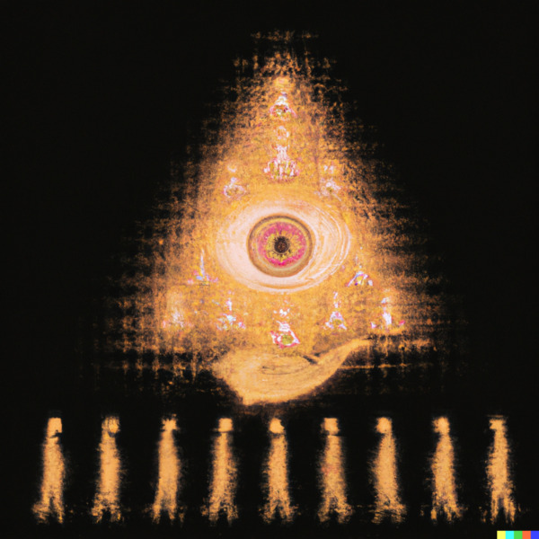

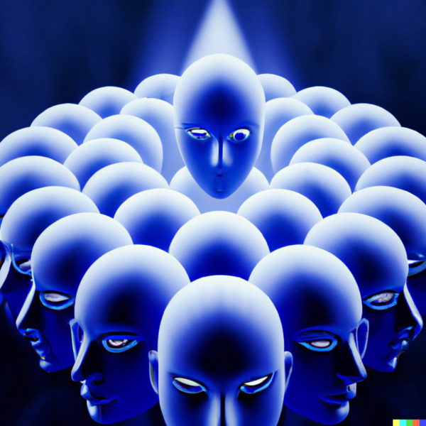

This prompt was inspired by [a tweet by hardmaru](https://twitter.com/hardmaru/status/1531974184578207746) (1 June 2022):

> I just realized that I’m one of only a handful of people in the world who has access to both [#Dalle](https://twitter.com/hashtag/Dalle?src=hashtag_click) and [#Imagen](https://twitter.com/hashtag/Imagen?src=hashtag_click)

[Reddit comments](https://www.reddit.com/r/dalle2/comments/v35ni7/the_few_human_beings_chosen_by_ai_religious_art/), presumably by humans, added an even more religious vibe:

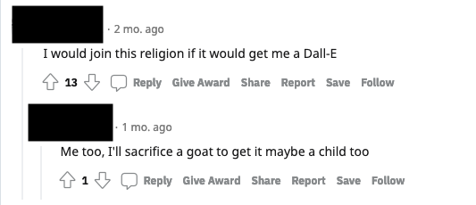

There is a lot of room to start a new AI cult. Fortunately, DALL·E 2 started giving access to more people. I bet it has saved quite a few goats, and maybe some children too.

### Baseline

In AI baseline keeps constantly changing. In most fields, progress is slower than advertised. In deep learning, things move rapidly from “the Holy Grail” to “you can run in a Jupyter Notebook tutorial”-level. So, here goes my personal benchmark for symbolism, a Polish poster for a play Stalker (from 2012, NOT AI-generated)

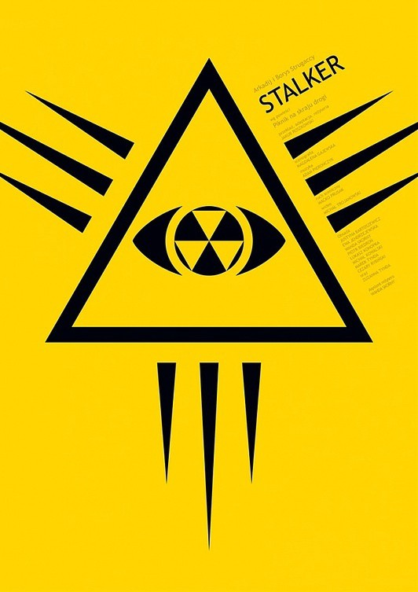

While neither the book “Roadside Picnic” by Strugatsky brother nor the cinematic poetry [“Stalker” by Tarkovsky](https://www.youtube.com/watch?v=Q3hBLv-HLEc) are about God or radiation, in my opinion, a combination of these symbols works perfectly. I wouldn’t create it by myself, yet after seeing that I would guess the movie.

### Examples

Let’s go with a gallery of examples. There will be various ones, more and less symbolic, containing references to deities, spirits, etc. The choice is mine and purely subjective. For some prompts, ALL images were wonderful; others required cherry-picking or didn’t work at all. I generated much more, so you won’t see here [a LinkedIn profile picture of a velociraptor in a suit](https://www.reddit.com/r/dalle2/comments/v411w9/velociraptor_in_a_suit_studio_portrait_dark_bg/) or [a lizard working as a taxi driver](https://labs.openai.com/s/BjMtgzd4zlrreWQnEHn1cbDn)”.

Feel free to just look at the images — the text in between is just to feel the space and bore you with tangential remarks.

All prompts are mine unless stated otherwise. All images were gereated by #dalle by OpenAI.

#### Octopus overlords

Octopodes are smart and lone predators, attacking each other on sight (unless during courtship or [on MDMA](https://phys.org/news/2018-09-octopuses-mood-drug-ecstasy-reveal.html)). There are the closest ones to alien minds — our last common ancestor was a flatworm, who had lived roughly 700M years ago. [Their path to intelligence was different](https://cosmosmagazine.com/nature/how-the-octopus-got-its-smarts/), as well as to sight. What if, in the dark depths of the oceans, they learned beyond what is conceivable by furless apes?

Here is an all-knowing octopus, showing us the path to enlightenment:

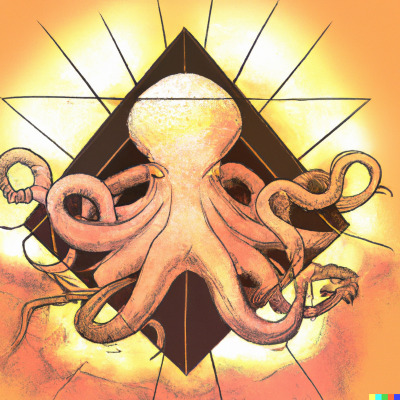

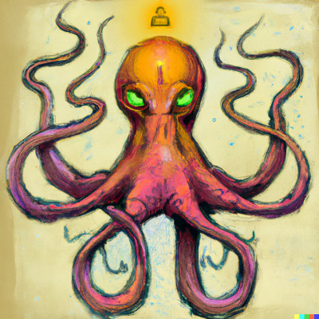

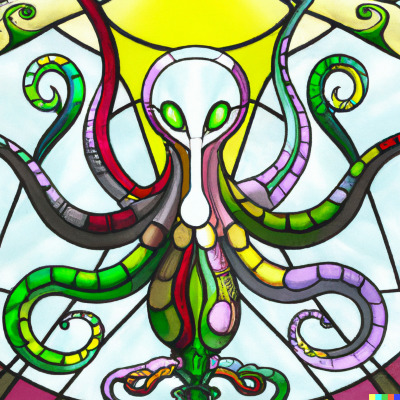

#### Priests

And how about priests among various species?

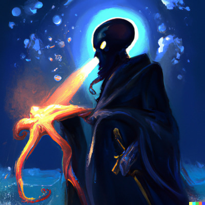

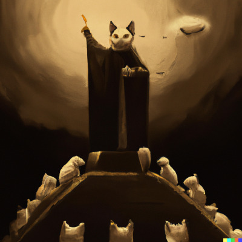

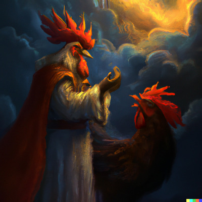

#### Meaning

Who knows more: one who knows the answer to the meaning of Life, Universe, and Everything: a mouse, [Noam Chomsky](https://en.wikipedia.org/wiki/Colorless_green_ideas_sleep_furiously) (here’s a check-mate for you), or Microsoft Word Paperclip?

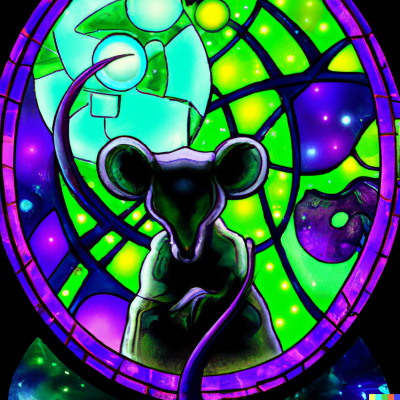

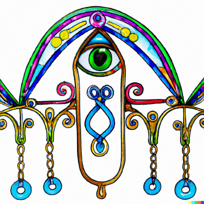

#### Fruit of knowledge

In my headcanon, it does not matter what was the fruit of knowledge. What matters is that the fruit was fermented. In a more traditional (yet scientific) view, the problem was not eating fruit, but planning the seeds — leaving the Paradise/Arcadia of a hunter-gatherer society, to the agricultural lifestyle. See [height as a marker of health and nutrition, 16 000 BCE to now](https://ourworldindata.org/grapher/human-heights-over-the-long-run).

However, if you want to know which fruit— there are not many things more tempting than good lemonade on a warm day. And I don’t think that being tempted is a bad thing. I share my value system with Eve and Pandora — [curiosity is worth pain](https://xkcd.com/242/).

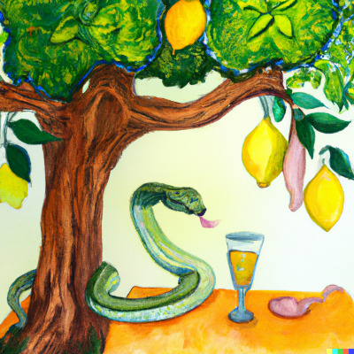

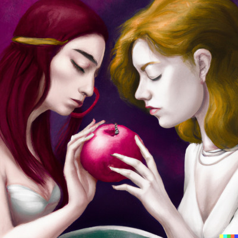

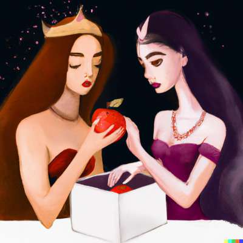

#### Venus Flytraps at the Gates of Paradise

Lemons ([it rhymes with “demons”](https://www.gocomics.com/jim-benton-cartoons/2015/09/28)) and malicious apples are one thing. What is important is that it was humans who learned from the Tree, a plant, not the other way. And now you know who guards the Garden of Eden.

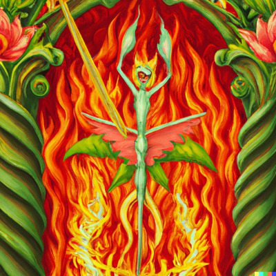

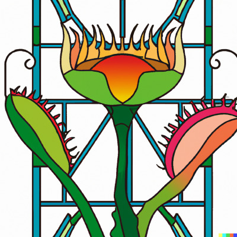

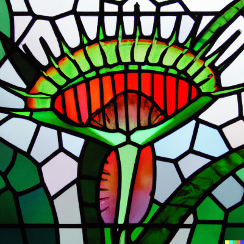

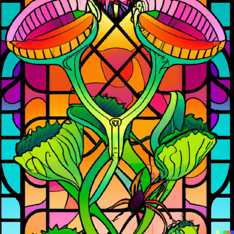

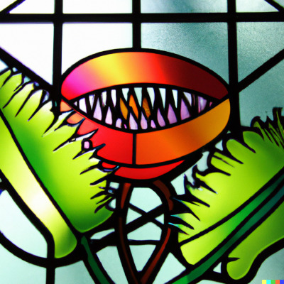

#### Cosmic flora and fauna

Speaking about Venus Flytraps, let’s see what cosmic ones look like. And the same for ferrets. The ferret prompt idea by Philippe Cochin.

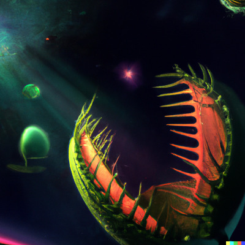

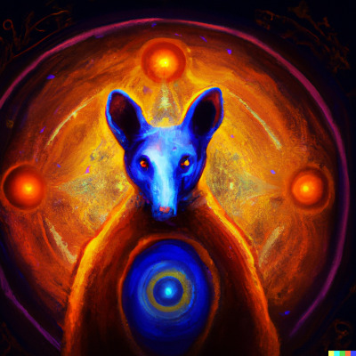

#### Hawaiian pizza Tarot cards

Tarot has its believers and users. For others is it superstition or black magic. For me, it is a means of artistic expression — for example, [“Hexen 2.0” by Suzanne Treister](https://www.suzannetreister.net/HEXEN2/HEXEN_2.html), which covers “mysticism of the last century”, from the counterculture, through secret US projects, to transhumanism.

So well, how about a pizza with pineapple? I guess it is a lesser-known minor arcana — “toppings”. If you are Italian, it is the worst card you can draw.

Prompt idea by Maja Ratyńska.

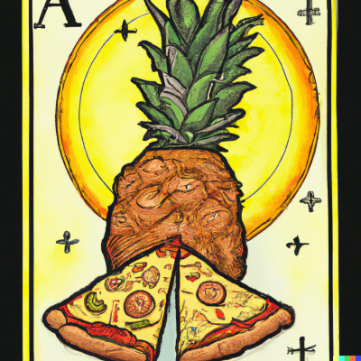

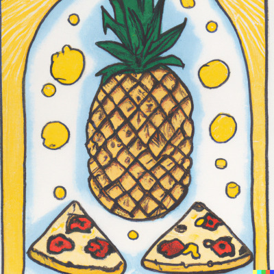

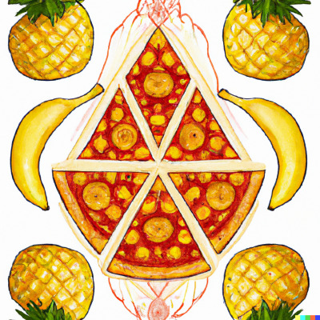

#### Solaris Ocean

The Ocean from “[Solaris](https://en.wikipedia.org/wiki/Solaris_%28novel%29)” by Stanisław Lem is another alien mind, much further than octopodes. So alien that it is hard that it challenges our assumption of what is mind.

> We have no need of other worlds. We need mirrors. We don’t know what to do with other worlds. A single world, our own, suffices us; but we can’t accept it for what it is.

So, here goes “The Mind of the Lem’s Solaris Ocean” as digital art, Beksiński-art, and psychedelic art.

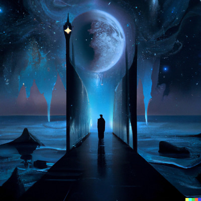

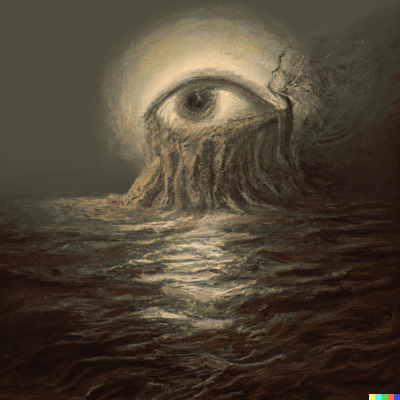

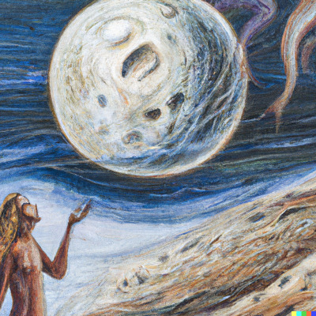

#### Lovecraftian geometry

As H.P. Lovecraft wrote in “At the Mountains of Madness”:

> The effect was that of a Cyclopean city of no architecture known to man or to human imagination, with vast aggregations of night-black masonry embodying monstrous perversions of geometrical laws and attaining the most grotesque extremes of sinister bizarrerie.

If you want to experience the hyperbolic geometry of the sunken city of R’Lyeh, play [HyperRogue](https://www.roguetemple.com/z/hyper/). Here we use the M.C. Escher style:

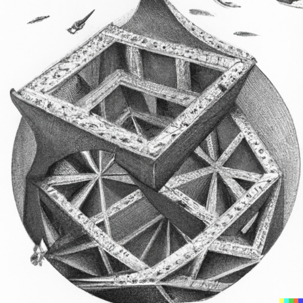

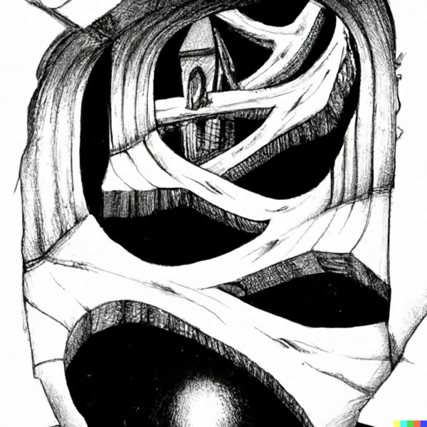

#### Eldritch horrors

Lovecraftian eldritch horrors as drawings from Necronomicon and religious art. Unsettling.

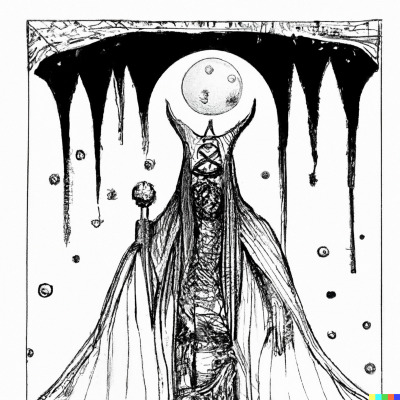

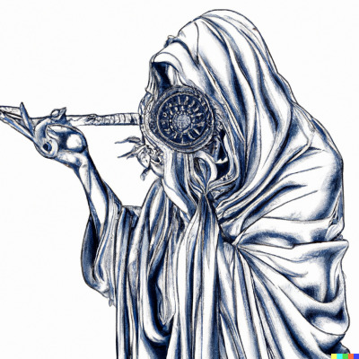

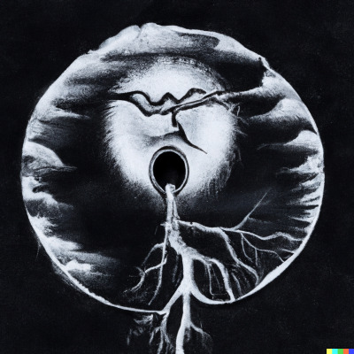

#### Great Old Ones

From H.P. Lovecraft again:

> Yog-Sothoth knows the gate. Yog-Sothoth is the gate. Yog-Sothoth is the key and guardian of the gate. Past, present, future, all are one in Yog-Sothoth.

Here we have Yog-Sothoth {transcending space and time, who is the gate and the key, the god of spacetime} as religious art.

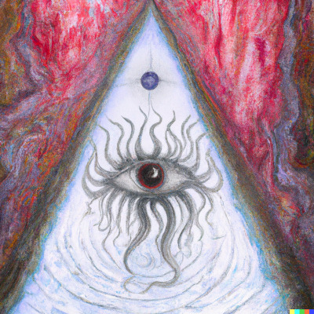

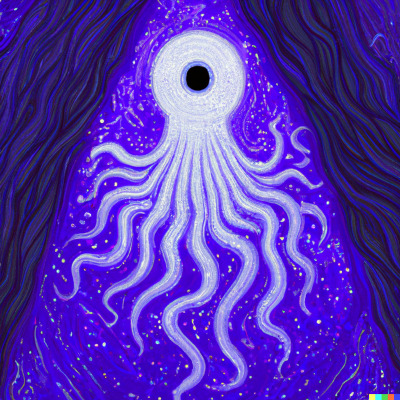

#### End of all things

And what does the end look like?

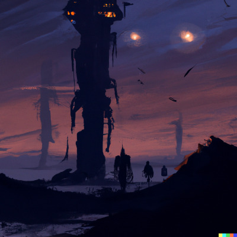

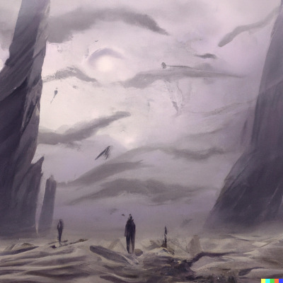

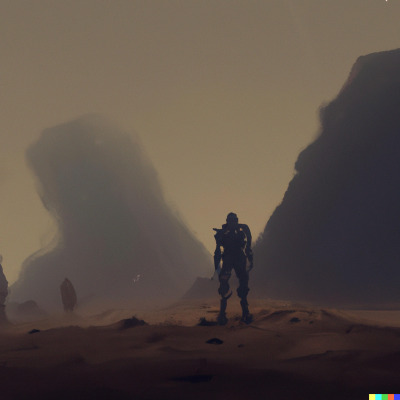

#### Life and death

Maybe the isn’t an end, but an eternal cycle.

Like in their story [“The Egg”](http://www.galactanet.com/oneoff/theegg_mod.html) by Andy Weir (also [animated by Kurzgesagt](https://www.youtube.com/watch?v=h6fcK_fRYaI)), which kind of resembles the quantum field theory-like views of beings, especially in the spirit of the [one-electron universe](https://en.wikipedia.org/wiki/One-electron_universe). Or one of my recently favored songs, [“Night 13” by Auri](https://www.youtube.com/watch?v=sAnZUKoOSL8).

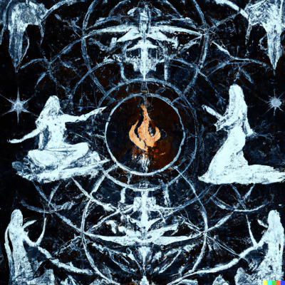

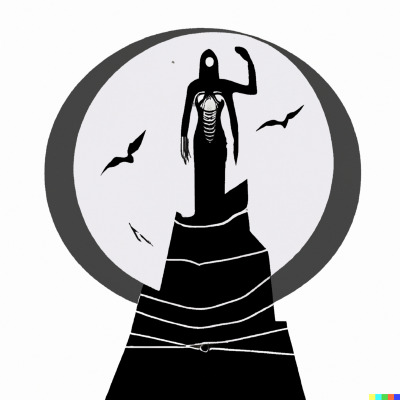

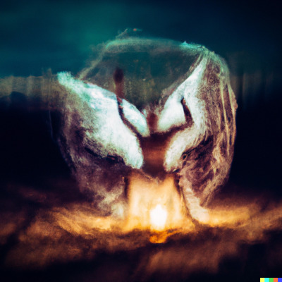

#### Judeo-Christian God

So, let’s see how THEY present themselves as a pillar of flame. Well… darker than you may have imagined.

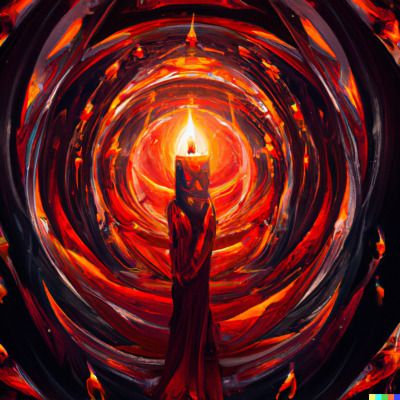

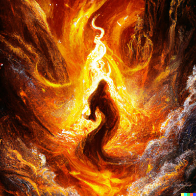

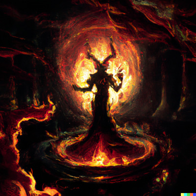

#### Seraphim and others

It saddens me that at some point angels became presented as cupids. Let’s see how they look… or rather, go one step further, as their true form is likely in the “you cannot see their face and live” category.

UTF8 trivia: ‘ꙮ’ is a rare Cyrillic ‘o’, as in “серафими многоꙮчитїи” (multi-eyed seraphim).

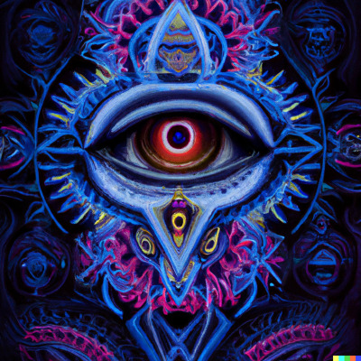

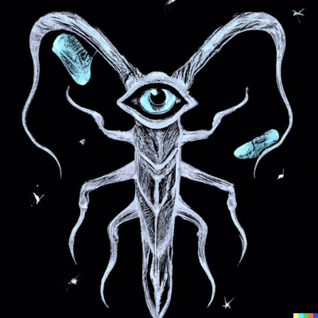

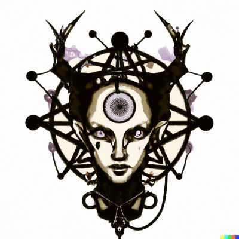

More on angels, or rather — many-eyed celestial beings, from Ezekiel’s vision.

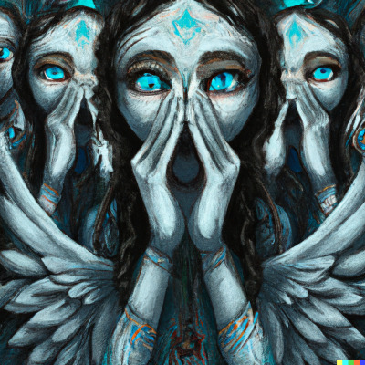

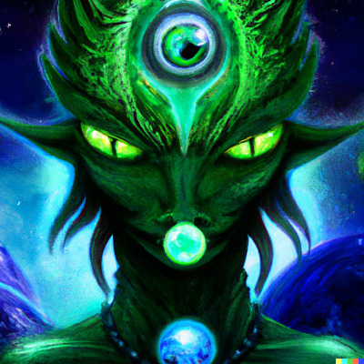

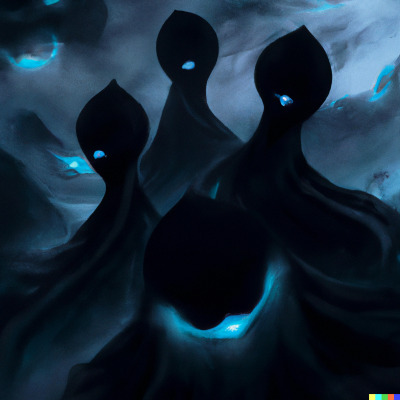

#### Greek mythology

If countless tentacles & eyes are too much for you, let’s go to Greek mythology. At least most of them have normal human bodies.

After his exile to the very Eastern Europe, and torturing his liver with vodka, Prometheus went back to the business of giving power to humanity. This time it is solar power.

Themis, while blind, deserves fancy eyeglasses. I love the depiction of eyes that have never seen.

#### Tolkien

Let’s not forget about Middle-earth. Not many know that Sauron's private life differs from his public image. Also — what if Galadriel took the ring?

#### Gender

Personally, I am far from any kind of spiritual male/female essentialism. When it comes to anything related to the psyche, [while there are gender differences on average, the overlap is enormous](https://thingofthings.wordpress.com/2017/05/05/the-cluster-structure-of-genderspace/). Still, it was interesting to play with the idea. Or rather — how does AI perceive it.

#### Spirits

So, what set me on the path of generating such images? I got curious about how DALL·E 2 melds ideas and asked to generate “A spirit in a waterfall of hearts”, specifying that it should be “digital art”. I got something I really liked:

Moreover, all other creations were both on point and interesting. I was both impressed and mesmerized.

#### Summer Solstice Fern Flower

Speaking about spirits in nature, I wanted to generate something for the Summer Solstice. In Slavic and Baltic folklore, that night a Fern Flower blossoms. [This Polish version on the Fern Flower](https://worldstories.org.uk/reader/the-fern-flower/english/269) is one of the first stories and remember. It is about curiosity, the quest for power, and misery. Maybe because it was the first, or more likely — as it resonated as much.

Quite a few stories mention that people need to collect this flower naked… Well, it is likely that young men and women knew that the quest for a non-existing flower is futile, so it won’t distract from other activities.

#### A few extra

Here is Cthulhu’s romantic side, a concept of a qubit, and once again venus flytrap, this time — a photorealistic one. Believe me or not, this plant is my “spirit ‘animal’”.

I went a bit over the edge with the last one, with a version for Pride Month 2022:

I even got [a wonderful review](https://www.reddit.com/r/dalle2/comments/v44mn5/joyful_anthropomorphic_venus_flytrap_studio/) on the last one:

> This guy fucking loves happy anthropomorphic Venus fly traps and it’s sick

### Notes

It is up to you if decide if DALL·E 2 creates images of any value — artistic, creative, or maybe with its superior knowledge it actually knows things beyond?

I reassure you, that it goes beyond my artistic skills. The closest thing I created in this genre is a [Sierpiński Eye of Providence](https://bl.ocks.org/stared/b8440943a1d72aed3033ea092a2a2902). While some results were underwhelming, in other cases I got intrigued about how would approach a given subject.

If you like to see more such images, the easiest way is to look at [#dalle on Twitter](https://twitter.com/search?q=%23dalle&src=typeahead_click) or Reddit [r/dalle2](https://www.reddit.com/r/dalle2/) (directly or via [Reddit Grid image viewer](https://redditgrid.com/r/dalle2)).

DALL·E 2 by OpenAI, while jaw-dropping, wasn’t the last step. [Imagen by Google](https://imagen.research.google/) offers in some cases better quality, see [this Two Minute Papers YouTube](https://www.youtube.com/watch?v=HyOW6fmkgrc). And an even newer model, [Parti](https://parti.research.google/) (also by Google), is mind-blowing.

I think there is enormous potential for creating randomized games and stories. I don’t think that it will take artists’ jobs for a fundamental reason — for a given prompt there are (almost) infinitely many ways to approach the subject, based on one’s subjective taste & experience.

If you plan to experiment with it right now, [dalle-mini](https://huggingface.co/spaces/dalle-mini/dalle-mini) and [MidJourney AI](https://medium.com/mlearning-ai/midjourney-ai-is-now-publicly-accessible-dont-miss-it-c4c6bb77c375) are the easiest to access.

**EDIT (20th July 2022)**: [DALL·E 2 is in public beta](https://openai.com/blog/dall-e-now-available-in-beta/), so you try it as well!

#### What’s next?

[Peter Weyland's TED Talk in 2023](https://www.youtube.com/watch?v=E4SSU29Arj0) is fictional, created in 2012. But unlike most sci-fi movies, gets uncanny with a quotation:

> We can create cybernetic individuals, who in a few short years, will be completely indistinguishable from us.

While various for of general intelligence may be far away (it turns out that for AI walking is harder than theorem-proving), I wouldn’t be surprised if it reaches the top-human level in writing and image creation.

So, what to do? Here is a text generated by GPT-3, back in June 2020 (prompt mine, in bold):

> **The following is short advice given by an omniscient AI acting as a spiritual leader similar to Buddha and Jesus.**

> **\[Human\] Hello, what’s the best piece of original, actionable advice you can give to humans?**

> **\[AI\]** The big tip is to stop looking at external validation for how good of a person you are. That includes money, fame, love, respect, being well-liked, sex, friends, whatever. None of those are your true rewards and all of them are dependent on your external environment. Even if you get 100% of them, the high is fleeting. Get into a flow of life where you get satisfaction from knowing you did the right thing in the moment and you have decent relationships, and you don’t have to worry about “am I successful enough?” all the time.
