Wystarczy co jakiś czas wrzucić mem o ADHD i dostaję multum pytań, jakbym był jakimś ekspertem. Nie jestem — ale i tak staram się odpowiadać jak najlepiej. A, że jestem leniwy i nie chce mi się powtarzać — spisałem najczęściej poruszane punkty. Niezależnie czy masz, podejrzewasz się o, czy żyjesz z taką osobą — zapraszam do lektury!

tl;dr:

- ADHD to nie niedostatek uwagi, a jej niekonsystencja (częściej występuje hiperfocus)
- większość to nie chłopcy-rozrabiacy, a dorośli mężczyźni i kobiety
- to jest płynna skala, spektrum; w tym nawet nadaktywność to niezależny wymiar (wielu z nas to “daydreamers” — odpływający/e w swoje światy)
- o ile to coś innego niż autyzm, to nie jest przeciwne — i często współwystępują
- to neuroróżorodność, nie choroba; ma swoje plusy, minusy i charakterystykę
- niektóre symptomy ADHD (np. spóźnianie się) są krzywdząco traktowane jako wada moralna
- samodiagnoza jest OK, ale warto mieć jakiś reality-check z profesjonalistą
- leki często są pomocne, acz nie są warunkiem ani koniecznym, ani — wystarczającym
- dobór środowiska bardzo wpływa — czy będziemy jak ryba w wodzie, czy jak ryba, która ma latać
- do organizowania sobie zadań są narzędzie pod osoby z ADHD, np. Bullet Journal
- linki na końcu, bo inaczej się rozproszysz :)

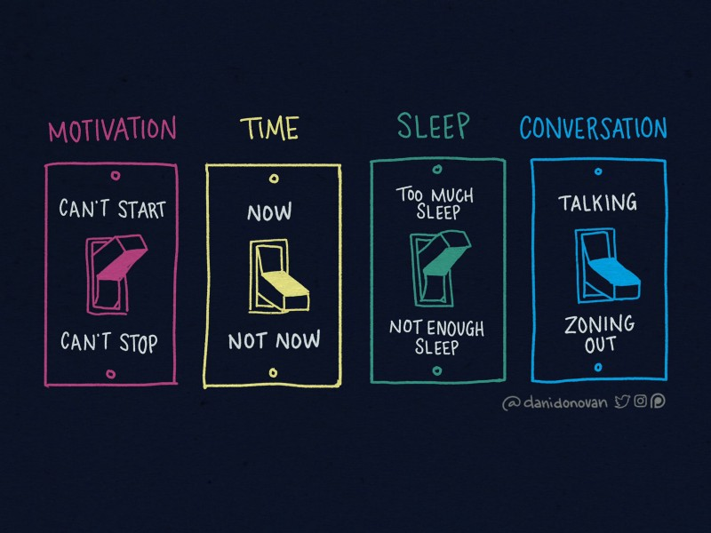

ADHD rozwija się jako ”Attention Deficit Hyperactive Disorder”. I jest to nazwa bardzo błędna, wzięta z perspektywy zewnętrznego obserwatora. To nie kwestia braku uwagi, a wręcz przeciwnie — nadskupienia, tyle że skaczącego jak żaba. W szkole czy pracy oczekuje się skupienia na zadanym zajęciu. Przy czym takie neurotypowe skupienie rzadko jest pełne: może 70%, pewnie częściej 30%. Ale jest konsystentne, bez “odpływania”, bez gwałtownych przeskoków. Osoba z ADHD, kiedy zadanie ją w danym momencie mocno zainteresuje, może skupić się na 100% (tak, że zapomni o jedzeniu i wszystkim wokół), kiedy jednak zadanie jest nudne, jej uwaga będzie gdzie indziej, a zadanie, o ile w ogóle, będzie przetwarzane przez małą część mózgu.

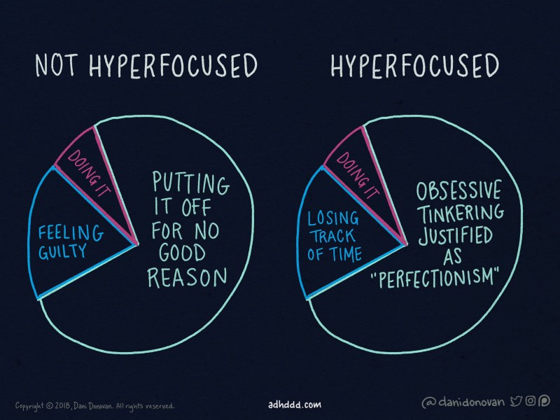

Kłopot jest z intencjonalnym “przyklejeniem i utrzymaniem” uwagi przy danej sprawie, zwłaszcza “nieciekawej”. Uwaga żyje własnym życiem przeskakując z obiektu na obiekt mimo woli własciciela. Albo przykleja się do danego zajęcia i ciężko ją oderwać. Kiedy człowiek usiłuje ją przytrzymać (tj. skoncentrować się) na intencjonalnie wybranej sprawie, zabiera mu to o wiele więcej energii niż osobie neurotypowej. Stąd szybkie męczenie się i krótki czas efektywnej pracy. Albo siedzenie przy czymś interesującym wiele godzin, zaniedbując inne rzeczy. W kwestii działania często jedyny czas to “teraz” (deadline’y). Rzeczy “na kiedyś” są zwykle “na nigdy”, bo w międzyczasie coś innego zaabsorbuje uwagę. Np. dla mnie praktycznie jedynym sposobem sprzątania mieszkania jest zaproszenie kogoś — wtedy “kiedyś” zmienia się w “na już”. Przyznam się, że czasem zapraszam ludzi do siebie dokładnie w tym celu (do czego zresztą zachęcam).

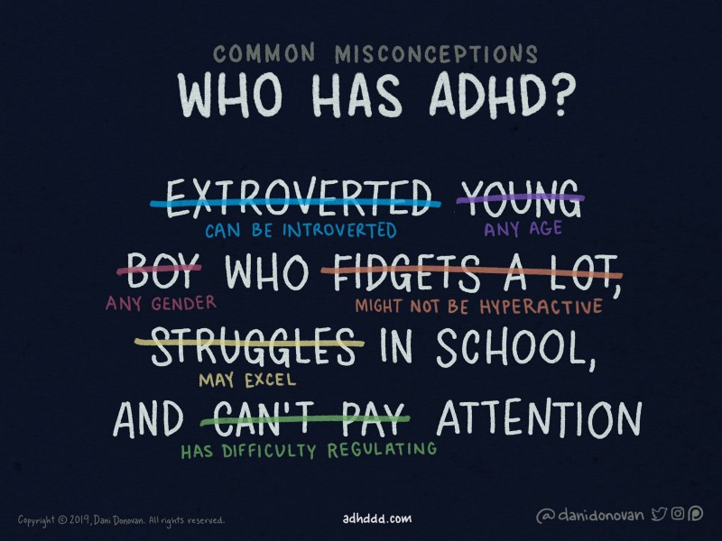

W powszechnej, stereotypowej świadomości ADHD to chłopcy-rozrabiacy. Ale ADHD występuje całe życie (czyli tak samo tyczy się dzieci i dorosłych), i u mężczyzn, i u kobiet. Część osób ma nadaktywność ruchową, co nie znaczy od razu, że muszą biegać czy krzyczeć — niektórzy w trakcie zajęć bawią się długopisem, szydełkują, rysują, spisują losowe pomysły. Przy osobach z ADHD takie zachowanie nie świadczy o olewaniu wykładowcy, wręcz przeciwnie, osoba z ADHD stara się na wszelkie dostępne jej sposoby pozostać tu i teraz i słuchać, zamiast odpłynąć myślami w dal. Często też owa uwaga skupia się wewnątrz — daydreaming. Co więcej, nawet sama nadaktywność nie jest główną cechą. Większość osób z niekonsystencją uwagi leży gdzieś na środku osi ADHD-ADD (ADHD bez “H”).

To dlaczego chłopcy-rozrabiacy? Ano bo tacy przeszkadzają — i czy to nauczyciele chcą ich uporządkować, czy też rodzice chcą ich bronić diagnozą. (Nawiasem pisząc, co jest zresztą częstym patternem ogólnych podejść do neuroróżnorodności: nie chodzi o to, by dbać o dobrostan i rozwój jednostki, ale stwierdzić “zaburzenie” i siłą sprawiać, by ktoś zachowywał się “normalniej” czyli dosłownie — zgodnie z normą społeczną.)

Osoby, które nie sprawiały problemów wychowawczych (w tym większość kobiet), zwykle nikt nie będzie próbował diagnozować. Co najwyżej będą słyszeć codziennie, jakie są beznadziejne, bo nie uważały, zapomniały czegoś, rozproszyły się, skupiły się, spóźniły — wszystko w kategoriach moralnych i z budowaniem poczucia winy, że “gdyby tylko się postarał(a)/szanował(a)”. Jeśli miałæś łatkę osoby “zdolnej, ale leniwej”, ze słomianym zapałem, czy też tysiącem pomysłów (ale nieumiejącej się skupić na żmudnej pracy), to cóż — jesteś w “grupie ryzyka”. :)

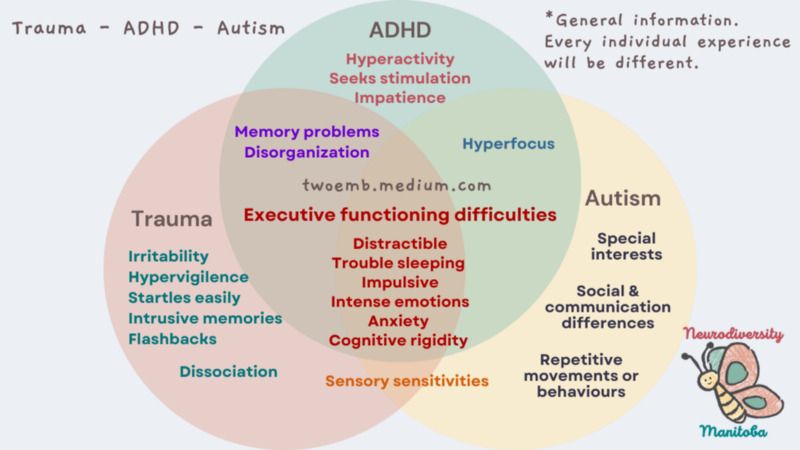

ADHD to spektrum — nie ma żadnej przesłanki, że to coś zero-jedynkowego. Na studiach nie podejrzewałem się o ADHD, bo mieszkałem z osobą zdiagnozowaną, w kontraście z którą byłem ostoją zorganizowania. Dopiero wiele lat później zorientowałem się, że ta osoba miała najintensywniejsze ADHD z wszystkich mi znanych ludzi. Więc tak, formalnie “wszyscy są trochę ADHD” — tak samo jak ”wszyscy są trochę wysocy”. Ale 170cm to jest trochę, ale co innego niż doświadczenie osoby 200cm. Czułem się niski, bo miałem tylko 188cm.

Myślałem też, że skoro jestem autystą (self-diagnosis, but beyond any reasonable doubt), to nie mogę mieć ADHD, bo to przecież przeciwny biegun. Otóż nie — tj. o ile w niektórych aspektach jest przeciwny, to w innych podobny. I często współwystępują. ADHD + autyzm to niezły rollercoaster, balans pomiędzy potrzebą nowości, wrażeń i bodźców, a potrzebą struktury, nadwrażliwością bodźcową, i rozwalającą reakcją na zmiany.

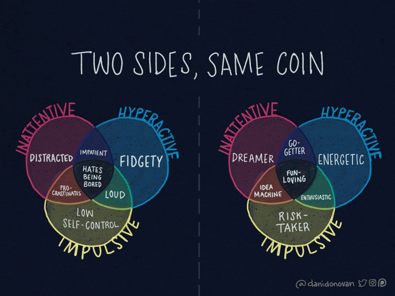

ADHD to nie choroba, to pewien rodzaj neuroróżnorodności. Można skontrastować choćby z depresją, której praktycznie nikt mieć nie chce (z wyłączeniem Schopenhauera i Kierkegaarda).

ADHD ma swoje plusy i minusy, nie jest czymś gorszym (ani lepszym). Bardzo zależy od i sytuacji, w której się ktoś znajduje, i od natężenia ADHD. Często głównym problemem jest to (jak przy każdej neuroróżnorodności), że społeczeństwo jest skonstruowane pod inne ramy, i wszystko wystające chce wbić niczym gwoździa w deskę, by było równo. Stąd młynki — typu przestarzały system szkolnictwa — rzadko są dobre dla osób z ADHD. Opierają się na twardym systemie wywodzącym się z pruskiej szkoły wojskowej — dyscyplina, podział na kohorty wiekowe, bezwzględna hierarchia, z góry ustalone bloki czasowe i plany. Życie dorosłe jest inne, o ile ma nowe wyzwania (np. płacenie rachunków i składanie zeznań podatkowych na czas), to jest też pole do szukania branż i stanowisk (a także ogólnego stylu życia) bardziej pasujących do naszej osobowości.

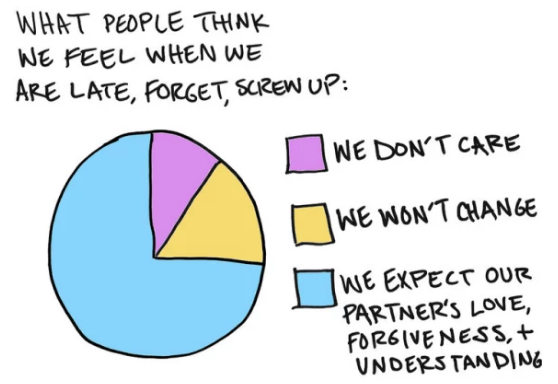{ class=width-max-half }

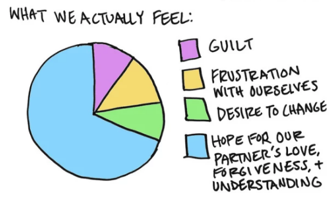{ class=width-max-half }

- [19 Illustrations That Sum Up Being In A Relationship When You Have ADHD](https://www.buzzfeed.com/carolinekee/netflix-and-50-different-activities-at-once) by Caroline Kee

I jeszcze — kwestia “moralnych wad”. Zmarnowanie godziny na bezużyteczny wykład czy bezsensowne spotkanie firmowe jest uważane za OK (a to często dziesiątki lub setki osobogodzin!). Za to spóźnienie się na jakieś spotkanie nawet 5–15 min jest brane za “brak szacunku”, złą wolę, czy inną moralną winę. To nie fair. Coś jakby oskarżać neurotypowych, że brak 10 pomysłów na minutę to “nawet nie próbują używać mózgu” i obwiniać ich każdego dnia. To byłoby równie nie fair. Wg mnie szanowanie innych polega m.in. na zrozumieniu i braniu pod uwagę, że każdy ma inne możliwości.

Czy formalna diagnoza jest konieczna? Tu się pewnie narażę — dla dorosłych może, ale często nie musi, grać ona rolę. Mam świstek (diagnoza w wieku 33 lat), ale mało co z niego wynika. Za to bardzo wiele wyciągnąłem z rozmów z osobami z ADHD, z materiałów, itd. Przy czym zaznaczam — warto porozmawiać z osobami, które się na tym znają. Formalna diagnoza to jedno. O ile obarczona błędem, to jednak mniejszym niż bazowanie samodiagnozy na memie czy też pojedycznym teście internetowym. Można się posądzać o (lub odsądzać od) ADHD, a jednak bazuje się na niewiedzy czy stereotypach lub też brakuje punktu odniesienia. Np. myślałem, że robienie rzeczy wyłącznie tuż przed deadlinem to standard, każdy tak ma — a jednak niekoniecznie. Też — inne zaburzenie czy czynnik środowiskowy, mogą mieć podobne objawy, a wymagać innego podejścia.

Diagnoza (w tym — samodiagnoza) ADHD często pomaga — choćby by zrozumieć siebie, swoją specyfikę, swoje silne i słabe strony, dowiedzieć się o podejściach osób.

Choć nawet po formalnej dowiedziałem się od rodziców, że “wreszcie znalazłem sobie papierek, by nie czuć się winnym” (praktycznie codziennie wbijali mnie w poczucie winy). Nie polecam nikomu — acz pewnie wielu z Was tego doświadczyło. Gdybym wiedział, że mam ADHD, to uniknąłbym ogromu bezsensownego poczucia winy, katowania się, szkodliwych fizycznie i psychicznie sposobów radzenia sobie, itd, itp. Jak powiedziałem znajomym, że mam ADHD — to wielu powiedziedziało “tak, to oczywiste”. Czułem się mocno wkurzony, że mi nie powiedzieli wcześniej — dość mocno mi by zmieniło moje dorosłe życie (a dostałem hinta dopiero w wieku 31 lat!). Więc jak wiesz, że znajomy zachowuje się podobnie do Ci znanych z osób (a tym bardziej: gdzie podobne problemy i frustracje mu/jej niszczą życie), to wspomni temat — a nuż niesamowicie pomożesz.

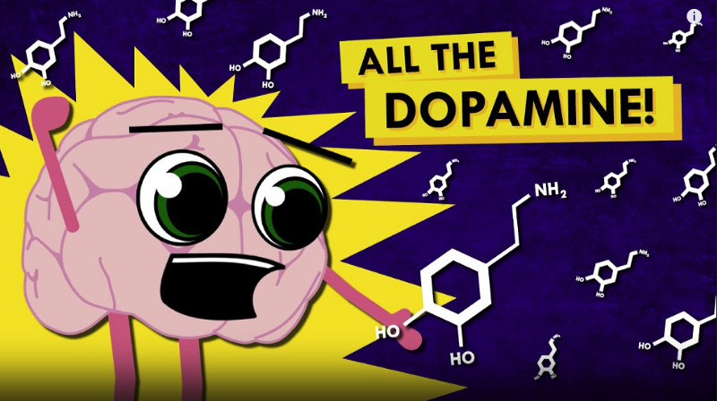

No, i kwestia leków — są relatywnie skuteczne, przynajmniej w porównaniu z innymi lekami na mózgownicę. Działają doraźnie, tj. nie zmieniają trwale (to nie choroba!), a pomagają np. w trakcie godzin pracy skupić się na projekcie. Dla wielu to było odkrycie, że wreszcie \*rozumieją\* ludzi, co powiedzieli, że “nie zawsze się chce, ale wystarczy się zabrać”. Przy czym zaznaczę, że nie są panaceum, i ani koniecznym, ani wystarczającym warunkiem utrzymania skupienia. I też — dla niektórych efekty uboczne mogą przeważać nad korzyściami, stąd też leki nie każdemu pomagają.

Co może być mocno nieintuicyjne — owe leki to głównie stymulanty, działające na dopaminę — neuroprzekaźnik odpowiadający (m.in.) za motywację. Za mało dopaminy i nic się nie chce. Za dużo i hiperfocus — często cudownie, ale i może pójść w coś nie do końca użytecznego, czy też rozwalić cykl dnia, zapomnieć o jedzeniu i piciu, itd. Czy też owszem zryw, a po tym zjazd. Niski poziom dopaminy działa \*trochę\* jak depresja, ale z jedną kluczową różnicą — to “depresja pieska”. Czyli “nic się nie chce, za nic nie da się zebrać”, po czym jest bodziec (wyciągnięta smycz czy rzucona piłeczka) i nagłe full power.

Przyjmowanie nie jest deficytem siły woli (tak nawiasem pisząc, siła woli jako wyznacznik moralności to niezły mit — czy to przy ADHD czy przy odchudzaniu; polecam książkę Roy’a Baumaistera). Przynajmniej nie bardziej niż noszenie okularów, gdy się jest krótkowidzem. Tak, można mrużyć oczy, ale ani to zdrowe, ani skuteczne.

Jedną z krytyk jest, że “ale te leki też zwiększają skupienie osób bez ADHD”. Po pierwsze — nie zawsze, a przynajmniej nie w małych dawkach. Po drugie, znam kilka osób, które mówiły “ale na mnie też działa, a nie mam ADHD”… po czym po kilku latach dostały diagnozę. Po trzecie — nawet jeśli, to i co z tego? Wg mnie zwiększanie swoich możliwości jest tak samo dobre jak łatanie deficytów. Oczywiście, jak we wszystkim, nie należy nadużywać. Ale to kwestia dowolnych substancji psychoaktywnych, włącznie ze znaną i lubianą przez wielu kawą.

Co do tego, jak postępować z dziećmi — temat ważny tu niestety mało się wypowiem (może pomiem coś więcej jak będę miał dzieci). Jako regułę kciuka traktowałbym jednak, czy leczenie jest podejmowane dla konformizmu (wbicia w system, np. szkolny, bez możliwości znalezienia czy bez podjęcia szukania alternatywnych rozwiązań), czy z pożytkiem i realną potrzebą dla dziecka. Pierwsze może znaczyć, że to dla naszej wygody i spokoju — kosztem indywidualnego, wyjątkowego rozwoju dziecka. I jego zdrowia psychicznego.

Najczęstszymi lekami jest metylofenidat (Ritalin, Concerta, Medikinet), w USA też — sole amfetaminy (Adderall). O ile często pomagają na skupienie, nie są wolne od efektów ubocznych (m.in. zwiększenie akcji serca, zwiększenie lęków). Dla mnie zdecydowanie najlepiej działa Armodafinil — enancjomer Modafinilu, inhibitor wychwytu zwrotnego dopaminy. Pierwotnie opracowany jako lek na narkolepsję, ale świetnie się sprawdza w ADHD. W Polsce nie jest zarejestrowany, co jest smutne, bo pewnie tego psychiatra nie zapisze (EDIT: jest Actimodan, zarejestrowany od niedawna). Generyk, więc nie ma zachęty finansowej dla koncernów, by prowadzić drogie badania. Stąd dzielę się tym z ręką na sercu, bo inaczej ta informacja mogłaby nie dotrzeć. Ale to lek, który można sprowadzić, i zarówno jego kupowanie, jak i posiadanie jest legalne. Taki status ma resztą nawet w Singapurze, bardzo restrykcyjnym w sprawie substancji. Nie daje haju (w żadnym sensie), nie pobudza za bardzo (mniej niż kawa), nie ma efektu odstawienia, a jeśli tolerancja rośnie to bardzo mało. Daje taki “focus snajpera” — tj. skupienie, ale spokojne. Nie, nie jest panaceum — też się rozpraszam, ale znacznie mniej. Podkreślam raz jeszcze: “dla mnie działa” — każdy reaguje na leki trochę inaczej, no i przed przyjęciem warto w ten czy inny sposób skonsultować.

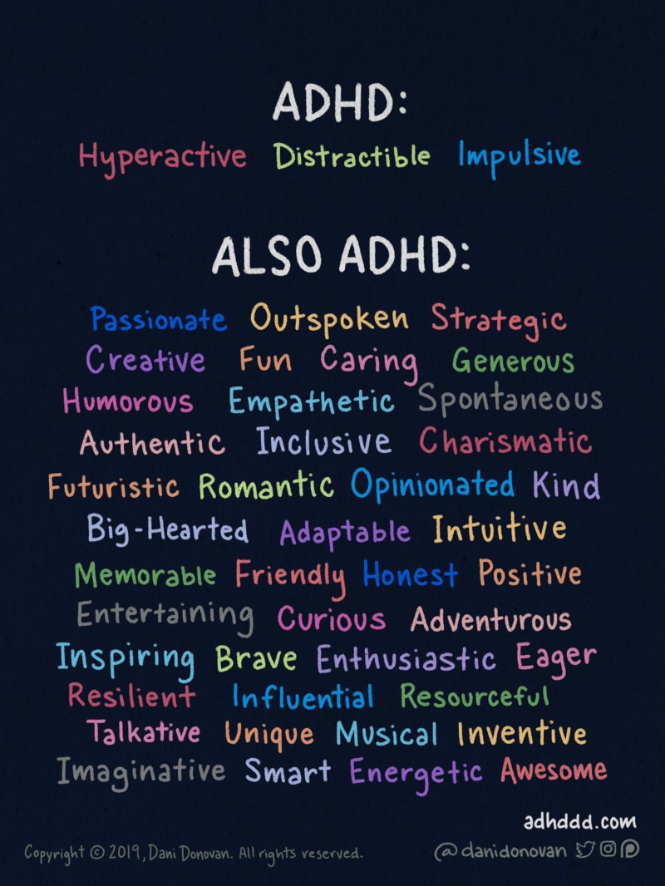

A jak sobie znaleźć środowisko, w którym będziemy czuć się swobodnie z naszym ADHD? Ogólne “to zależy” — bo ADHD i też ma swoje podwymiary, no i jest ogrom innych wymiarów naszej psychiki, zainteresowań, umiejętności, i aktualnego rynku pracy. Niektórzy potrzebują dynamicznego środowiska, inni wręcz przeciwnie — takiego, które z zewnątrz ich uporządkuje. Z mojej strony doktorat był drogą przez mękę — o ile relatywnie mało struktury, to też zdecydowanie za mało zewnętrznych bodźców, i projekty bez “nagród pośrednich” (przy ADHD duża nagroda w dalekim horyzoncie totalnie nie działa). Programowanie i analiza danych zaś super — często po kilku linijkach mamy informację zwrotną (zwykle, że coś nie działa, ale i to dobre!). Też jak najbardziej spisują mi się freelancing, consulting i startupy — dokładnie coś zgranego z moim trybem funkcjonowania, gdzie elastyczność i zrywy są często bardzo pomocne. Dużo małych dealine’ów, warsztatów na klienta ja jutro — yeah! Dla Ciebie może być inaczej — jak to się mówi YMMV, You Millage May Vary.

Nawet gdy praca nam organizuje rzeczy (zwykle nie), to w życiu osobistym jest masę rzeczy do ogarnięcia. Czasem partner(ka) pełni rolę osobistego managera, ale jest to OK wyłącznie wtedy, gdy świadomie dwie osoby zgadzają się na to. Nie jest OK, gdy po cichu zwala się to na drugą osobę i ma ona od groma “niewidzialnej pracy”. Przy czym spora przestroga — to, że ktoś nie ma ADHD, nie czyni z człowieka wszechstronnego mistrza organizacji. No i nawet przy najlepszych wiatrach, uzależnia i odbiera sprawczość.

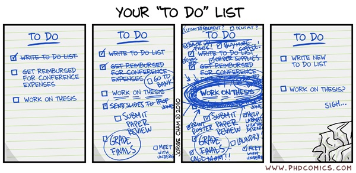

Typowe listy TODO rzadko działają. Przynajmniej u mnie — zawsze zaczynało się od “wow, super” przez kilka dni, a może i nawet tydzień-dwa. Następnie on-and-off, używanie i nie. No i ściana płaczu zaległych zadań, rzeczy “na wczoraj”, “na tydzień temu” i… “na kilka lat temu”. Otwieranie niekończącej się listy z zaległościami wpędza w poczucie winy i odbiera resztki motywacji. Za to często świetnie działa pisanie rzeczy na każdy dzień od zera. Rzeczy nie zrobione \*domyślnie\* znikają. Chyba że wykonamy świadomą decyzję wpisania znów. I to dobre — bo tak naprawdę większość rzeczy nie jest tak istotna. Plus, w ADHD ma się ciągotę do wpisania wielokroć więcej — więc siłą rzeczy nawet przy tym samym nakładzie pracy tych niewykonanych punktów będzie nieporównywalnie więcej.

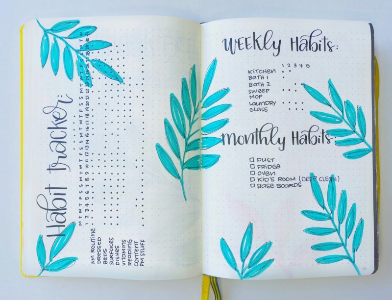

Wiele moich znajomych z ADHD robi tzw. Bullet Journal — styl planera, który z jednej strony jest b. elastyczny, z drugiej — dba, by główne rzeczy nie uciekły. Kilka osób pokazało mi swoje notesy — i to czasem były małe dzieła sztuki. Ja nie jestem pod tym względem szczególnie utalentowany — i nawet czytanie własnego pisma ręcznego to coś jak odszyfrowywanie kultysty Cthulhu. Stąd o ile wiele osób to motywuje, to nie mnie.

Ale robię coś podobnego online. Piszę na komputerze na każdy dzień listę rzeczy do zrobienia, spotkań itd (lubię pisać na klawiaturze, elektronikę mam zawsze przy sobie). Jak coś więcej lub innego zrobię (choćby — przyjdzie nowy mail pracowy, na który odpisałem czy też zrobię pranie) to też dopisuję. Czasem okazuje się, że dzień, w którym “nic nie zrobiłem” jednak był taki, że może nie zrobiłem “tej głównej” rzeczy, ale było dużo pracy nad innymi ważnymi. Osobiście korzystam z Evernote’a, ale dowolny plik tekstowy działa. Do prowadzenia remontu generalnego mieszkania (tak, udaje się!) używam managera tasków LinearApp, bo lubię. Tutaj kluczowe jest dla mnie zarówno rozbijanie na najbardziej jasne podtaski (ach ta dopamina przy każdym “Done”), i dzielenia na tygodniowe sprinty (co by nie było, że wszystko naraz).

—

Jeśli dotarłæś do tego miejsca, to umiesz się skupisz i na bank nie masz ADHD. ;)

Dobra, żartowałem. Może na kilka razy. Lub się wciągnąłæś. Samo to nie świadczy w żadną stronę. Jak to Cię interesuje, napisałem tekst w dwóch podejściach, jedno 2h focus w pociągu (łatwiej mi się skupić, bo mniej możliwości i ustalony czas), potem z miesiąc prokrastynacji, potem edycja. Gdybym nie miał ADHD to nie jest tak, że bym to zrobił za jednym razem. Pewnie \*w ogóle\* nie miałbym pomysłu i zajawki by się zabrać. Zachęcam myśleć nie o tym czego, nie zrobi(li/ły), a za co się zabra(li/ły)ście!

Co dalej? Polecam kanał HowToADHD (krótkie i dynamicznie filmiki, dużo mi dały) oraz książkę “Driven to Distraction” (tu akurat się musiałem zbierać, bo czytanie książek idzie mi trudno — nie jest tak fast-paced, by zawsze utrzymać uwagę; ale b. wartościowa, też b. dużo przykładów życia kobiet z ADHD). Z polskich miejsc najbardziej polecam “Psycholog na spektrum” na FB.

Tekst skorzystał z uwag Anny Salwy i innych proofreaderów. Chciałbym podziękować Aleksandrze Zimoch za liczne i cenne uwagi do szkicu. Dziękuję też Tomkowi Kolinko, który kilka lat temu naprowadził mnie na trop, który okazał się bardzo celny.

#### Obiecane linki

Jessica McCabe, [HowToADHD YouTube channel](https://www.youtube.com/c/howtoadhd), zwłaszcza:

- [How to Know if You Have ADHD](https://www.youtube.com/watch?v=cx13a2-unjE)
- [ADHD in Women](https://www.youtube.com/watch?v=EMpt40zNK-w)
- [How to Get Stuff Done When You Have ADHD](https://www.youtube.com/watch?v=YLkOZhROvA4) — zwłaszcza, że jest tylko TERAZ i NIE TERAZ
- [Why the Bullet Journal is the Best Planner for ADHD Brains](https://www.youtube.com/watch?v=5hLnY9L1c-M)

Oraz

- E. Hallowell and J. Ratey, [Driven to Distraction (Revised): Recognizing and Coping with Attention Deficit Disorder](https://www.amazon.com/Driven-Distraction-Revised-Recognizing-Attention/dp/0307743152)
- P. Migdał, [ADHD tech stack: auto time tracking](https://pmigdal.medium.com/adhd-tech-stack-auto-time-tracking-b8ff5b6bc888)
- P. Migdał, [Don’t fight, flight (or freeze) your body and emotions](https://pmigdal.medium.com/dont-fight-flight-or-freeze-your-body-and-emotions-96f5aa30b299) — część o prokrastynacji
- [Hyperfocus — Wikipedia](https://en.wikipedia.org/wiki/Hyperfocus)
- R. Baumeister and J. Tierney, [Willpower: Rediscovering the Greatest Human Strength](https://www.amazon.com/Willpower-Rediscovering-Greatest-Human-Strength/dp/0143122231)
- [Armodafinil Reviews & Ratings — Drugs.com](https://www.drugs.com/comments/armodafinil/)
- [Ritalin User Reviews for ADHD — Drugs.com](https://www.drugs.com/comments/methylphenidate/ritalin-for-attention-deficit-disorder.html)
- [https://pinboard.in/u:pmigdal/t:modafinil](https://pinboard.in/u:pmigdal/t:modafinil)
- [ADHD Comics by Dani Donovan](https://www.adhddd.com/comics/) — z której ilustracji nagminnie korzystałem
- [Psycholog na spektrum/Psychologist on the spectrum | Facebook](https://www.facebook.com/Psycholognaspektrum)
