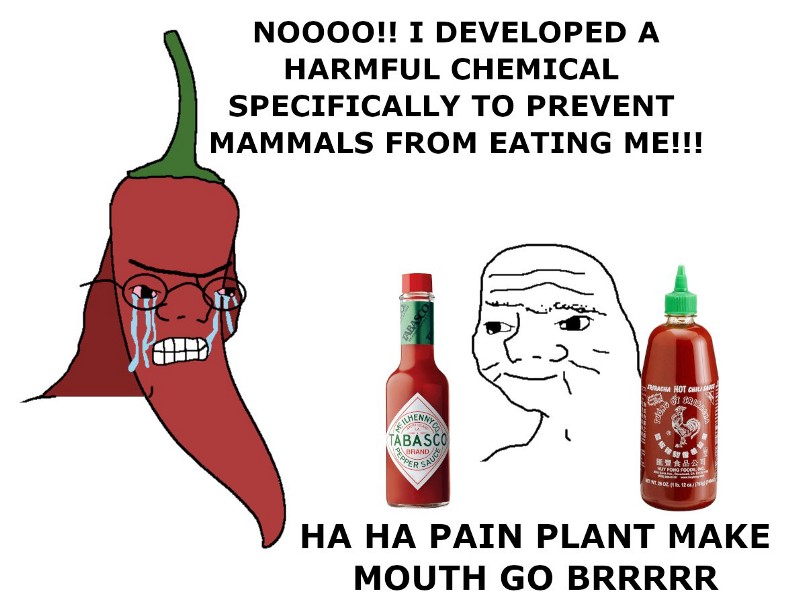

Capsaicin (8-methyl-N-vanillyl-6-nonenamide) is a substance found in chili peppers that causes a burning sensation. It binds to the [vanilloid receptor subtype 1 (TRPV1)](https://en.wikipedia.org/wiki/TRPV1), responsible for burning pain stimuli.

Isn’t calling it a psychoactive substance a stretch? Well, let’s look up [a mainsteam definition as found on Wikipedia](https://en.wikipedia.org/wiki/Capsaicin):

> “A psychoactive drug, psychopharmaceutical, psychoactive agent, or psychotropic drug, is a chemical substance that changes functions of the nervous system and results in alterations in perception, mood, consciousness, cognition or behavior.”

While in principle anything we eat affects our neurous system, not everything acts direcly on neurotransmitters. In case of capsaicin it is both a direct interation (vanilloid receptors) and as secondary effects —related to adrenaline and endorphines.

In mild doses, it brings a sensation of excitement (most likely adrenaline). It is mouthwatering even when I just think about it. My favorite dose is when I have a delicate sweat on my forehead, but not yet involuntary tears.

In higher doses, there is one threshold effect, at least for some. I mean, the level where eyes become torrents of tears, face turns red. At least for me — few minutes afterward, there is a tingly, electric, pulsating sensation in teeth nerves. Then, while there is still some residual burning sensation remaining, the flush of endorphins gives this blissful, albeit a bit drunk, state (_“Live is beautiful, I love you all, awesome…”_). Essentially getting high on locally-produced painkillers.

As for some other psychoactive substances, there is tolerance growth. Hopefully, it does not carry to much risk. As far as I know, all adverse effects are related to the pain sensation rather than the substance itself (here, I didn’t check, though). So it safer than, say, caffeine. And since the cost is negligible, tolerance growth won’t wreck our budget either.

1g of good Habanero pepper (600k on the [Scoville scale](https://en.wikipedia.org/wiki/Scoville_scale)) contains 40mg of capsaicin. For most people, it is, well, fairly spicy. A mildly spicy green chili (2200 on the Scoville scale) has 140µg capsaicin per gram. See:

- [Capsaicinoids Content in Habanero Pepper (Capsicum chinense Jacq.): Hottest Known Cultivars](https://journals.ashs.org/hortsci/view/journals/hortsci/43/5/article-p1344.xml)
- [Determination of Capsaicin and Dihydrocapsaicin in Capsicum Fruit Samples using High Performance Liquid Chromatography](https://www.ncbi.nlm.nih.gov/pmc/articles/PMC6264681/)

LD50 for humans is estimated to be 0.5–5g/kg. It would take around 100g of pure capsaicin to be deadly — but good luck with taking as much! So the ratio of deadly to active dose is around 1000000x. For caffeine, it is around 100x (coffee ~ 100mg, LD50 ~ 10g). As a side remark, in 1830s, Honoré de Balzac wrote with great passion about [The Pleasures and Pains of Coffee](https://urbigenous.net/library/pleasures_pains_coffee.html).

A recent paper [A Neglected Link Between the Psychoactive Effects of Dietary Ingredients and Consciousness-Altering Drugs](https://www.ncbi.nlm.nih.gov/pmc/articles/PMC6706955/) considers eating normal amounts of spicy food microdosing of capsaicin. Another paper shows that preferece for spicy food is related to sensation-seeking, see [Personality factors predict spicy food liking and intake](https://www.ncbi.nlm.nih.gov/pmc/articles/PMC3607321/).

Oh, capsaicin is a mechanism to ward off mammals. But then appeared homo sapiens, the apex predator of pain fruits.

