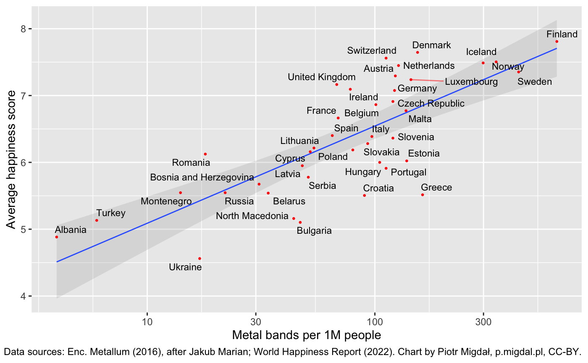

Do metal bands bring happiness or maybe does happiness bring metal bands? For clarification, its about music groups - not personal ornaments!

## Sources

Data comes from two sources:

- [Encyclopaedia Metallum](https://en.wikipedia.org/wiki/Encyclopaedia_Metallum) for metal bands count, 2016 (after Jakub Marian)
- [World Happiness Report](https://en.wikipedia.org/wiki/World_Happiness_Report) for the average happiness score, 2022

I got inspired by a map by [Jakub Marian](https://jakubmarian.com):

](./metal-bands-map-europe-jakubmarian.jpg)

and this meme:

, compared to Polish music & society](./scandinavian-music-society-meme.jpg)

If you want to explore the density of metal bands, see an [Interactive Map of Heavy Metal Bands By Country Per 100,000 People](https://www.gislounge.com/map-of-heavy-metal-bands-by-country-per-capita/).

_"Chocolate brings Nobel Prizes"_ is a reference to [There's A Shocking Connection Between Eating More Chocolate And Winning The Nobel Prize](https://www.businessinsider.com/chocolate-consumption-vs-nobel-prizes-2014-4?IR=T). Ironically, this research article takes this correlation non-ironically. While not entirely implausible (chocolate contains a lot of healthy ingredients that improve cognitive functions), most likely this relationship diminishes a lot after controlling for GDP per capita. Sure, the Swiss have lovely chocolate and they eat a lot of it. But also live in one of the richest countries.

](./chocolate-consumption-nobel-laureates.png)

## Disclaimer

[Correlation is not causation](https://xkcd.com/552/). I don't think there is a direct, causal link between metal bands and happiness. **The title is intended to be humorous, not treated as real science!** To the point that I didn't care that much that I combine data from 2016 (metal band count) and 2022 (happiness score).

I picked European countries on purpose - as it is a region (but not the only one!) in which metal music is a thing. Plus, to get all countries with a label, I had to reduce the dataset somehow.

In other countries most likely it correlated to other locally popular music or other creative activities. While possible, I would be rather surprised if the correlation goes only for metal music.

I guess that it is about conditions that are favorable for creative activities. That is - disposable income and safety net, tolerance and freedom of speech.

Also, **all** surveys measuring happiness have their shortcomings. The answer might depend on the meanings of words in a given language or culture. Especially as Finland, a country with the highest density of metal bands [is the happiest country in the world](https://www.theguardian.com/world/2022/mar/19/finland-named-worlds-happiest-country-for-fifth-year-running) but also [has relatively high suicide rates](https://jakubmarian.com/suicide-rates-by-country-in-europe/). If anything, results **may** make more sense within a given country:

](./money-can-buy-happiness-the-economist-2013.png)

## Source code

Generated in [ggplot2](https://ggplot2.tidyverse.org/). Since quite a few people asked about the code, I share it here to

```{r}
library(ggplot2)
library(ggrepel)

df <- read.csv("./metal_bands_happiness.csv")

ggplot(df, aes(x=Metal.bands.per.capita, y=Score, label=Country.or.region)) +
  scale_x_log10() +
  stat_smooth(method = "lm", size = 0.5, alpha = 0.2) +
  geom_point(color = "red", size = 0.5) +
  geom_text_repel(size = 3, point.size = 0.5, segment.alpha = 0.5, segment.color = "red") +
  xlab("Metal bands per 1M people") +
  ylab("Average happiness score") +
  labs(caption = "Data sources: Enc. Metallum (2016), after Jakub Marian; World Happiness Report (2022). Chart by Piotr Migdał, p.migdal.pl, CC-BY.")
```

`geom_text_repel` creates non-overlapping text labels [see its documentation](https://cran.r-project.org/web/packages/ggrepel/vignettes/ggrepel.html) and is a drop-in replacement for `geom_text`. I have just found it and I will use it again a lot.

[Full code with data as a GitHub Gist](https://gist.github.com/stared/ee607314c6581d9ba6141bb7d3a5b033).
