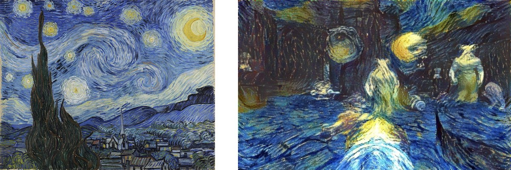
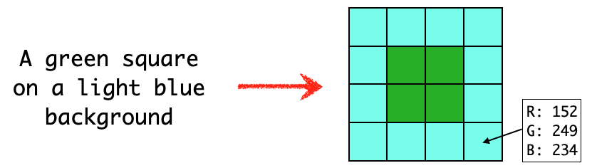

> “Alchemy does describe a means to make gold, but the procedure is so arduous that, by
> comparison, digging beneath a mountain is as easy as plucking peaches from a tree.” - [Ted Chiang, “The Merchant and the Alchemist's Gate”](https://en.wikipedia.org/wiki/Ted_Chiang)

The recent development of AI for image generation causes strong and polarized emotions among designers, photographers, and other visual artists - or at least, ones from my tech bubble. Quite a few issues are related to the usage of data from training, plagiarism, authorship of generated works, and reinforcement of stereotypes.

Yet, the most important one is general - how it would impact the workforce. In particular, if:

- AI will never become as good as human artists, or
- AI will take our jobs, the hard-earned skills will become redundant on the market.

Month by month, the balance shifts from the first to the second. I will argue that regardless of the progress of AI, artists will provide a unique creative value.

## Progress

For a long time, machines were nowhere near human visual skills. Then in 2012, there was a breakthrough - convolutional neural networks that were able to decently classify photos. For there next few years [the progress continued rapidly](https://paperswithcode.com/sota/image-classification-on-imagenet). The inverse problem of turning text descriptions (called prompts) into images posed a challenge. But step-by-step it went from [generating small images](https://arxiv.org/abs/1605.05396) in 2016, through [working with photorealistic faces](https://www.youtube.com/watch?v=kSLJriaOumA), to open-ended image-generation tasks. The process is so fast that [my 2021 review of readily-applicable AI for image generation and enhancement](https://arxiv.org/abs/2107.07397) aged poorly - in just a year. This field was revolutionized in 2022 with [DALL·E 2 by OpenAI](https://openai.com/dall-e-2/) and an open-source [Stable Diffusion](https://stability.ai/blog/stable-diffusion-public-release), which is a basis for multiple projects, including commercial [Midjourney](https://midjourney.com).

 and [Instagram @neilgoosey](https://www.instagram.com/neilgoosey/)](./neilgoosey-ai-art.jpg)

While we may argue that it still has problems with as basic things such as drawing realistic hands, the progress continues. Will there be room for human artists?

For the sake of this blog post, I will focus on art and design that is focused on creating images, to be viewed on a computer. That is - digital arts and photography. AI might not impact live-theatre actors or sculptors at all.

## Applied graphics vs fine arts

There are two kinds of creative works. One is something design-as-a-commodity, things that can be created by many professionals. For example, _“a stock photo of cheerful students playing chess”_ or _“female detective investigating an abandoned house, digital art”_. Clearly, each image has its quality and flavor depending on its creator. But it may matter less for the end goal.

I envision that while a lot of manual work will be automatized, and the job market for design will change, AI will remain a tool. While a handful of highly skilled professionals won't be affected, for the rest the workflow will change substantially. The impact might be less alike _“yet another Photoshop plugin”_ and more alike _“digital image processing tools in general”_. The invention of photography did disturb the market of painters (especially: for portraits) - but by no means ended painting.

Since a lot of repetitive work will be delegated to AI, the job landscape might change. For high-class specialists, it will be yet another tool they may use. For others - some will be effectively promoted to leadership positions. That is, focusing more on content and fine-crafting details while delegating simpler tasks to AI - rather than to junior graphic designers. Others might fall into a gap of _“nice skills, but not yet that offer a business advantage”_. Furthermore, the lower entry barrier to create any art is likely to result in the average quality going down - not unlike that plastic made manufacturing cheaper, but also less durable.

But there is also another kind of creative works - ones unique and highly dependent on both skills and vision of the artists. [“Mona Lisa” by Leonardo da Vinci](https://pl.wikipedia.org/wiki/Mona_Lisa) and [“Starry Night” by Vincent van Gogh](https://en.wikipedia.org/wiki/The_Starry_Night) are prime examples. Any other images inspired by their style might be good, but still - even if technically flawless, are not as original. For example, [H. R. Giger set the aesthetics for the Alien franchise](https://arthive.com/hansruedigiger/works/321698~Necronom_IV) and became a default nightmarish-organic style () - replicated by ordinary graphic designers.

Would be easy to create conceptually and aesthetically new works using prompts?
Think about _“addiction to social media”_ or even a broader idea _“a current societal problem”_. The question of _“how?”_ turns quickly into _“what do we want to do in the first place?”_. Sure, you can create a stock image of someone looking at their phone. But if you want to create something genuinely new, you will need to expand your prompt a lot. For example:

- _“a current societal problem”_
- _“a current societal problem, addiction to social media”_
- _“a current societal problem, addiction to social media, drawing”_
- _“a current societal problem, addiction to social media, drawing, colors”_
- etc, etc

As you may imagine, this prompt is nowhere near to one needed for creating something unique. Alternatively, instead of creating a single image for a given prompt, it may an AI model might create **all** images fulfilling the criteria. But then it will be billions or more, making choosing a desired one virtually impossible.

## Information theory

When I was a kid, I made a fascinating observation. With MSPaint alone, I can create any conceivable image. Including photography of anything, in any detail. I “just” need to fill the canvas, pixel by pixel, with a suitable color, parametrized by red, green, and blue components, each in the range of 0-255. Did I ever create with this technique anything that makes any sense? No. Was I right? In theory - yes. In practice, it is not a good way to go and is effectively impossible. It might tell a lot about why I ended up in information theory rather than - arts.

What is information theory? [ChatGPT](https://openai.com/blog/chatgpt/) answers correctly:

> Information theory is a mathematical framework for quantifying, storing, and transmitting information. It was developed by Claude Shannon in 1948 and deals with concepts such as entropy, data compression, channel capacity, and error correction. Information theory is widely used in many fields including computer science, electrical engineering, and statistics.

We measure information in bits. A single bit is how much you can encode in one 0 or 1. There is a nice introduction in [Solving Wordle using information theory](https://www.youtube.com/watch?v=v68zYyaEmEA) by 3Blue1Brown and in [Visual Information Theory](http://colah.github.io/posts/2015-09-Visual-Information/) by Chris Olah For an in-depth one, [Information Theory, Pattern Recognition and Neural Networks](http://www.inference.org.uk/itprnn/book.html) - a freely available book by David MacKay.

But let’s get back to the topic and quantify the length of a description needed to specify a concrete image. In English, we get roughly 10 bits per word. The last prompt _“a current societal problem, addiction to social media, drawing, colors”_ has 100 bits of information. 100 bits means that it is enough to distinguish from 2^100 equally likely possibilities. It is 1 and 30 zeros. A humongous number! But how many bits are there in a picture?

The [True Color standard](https://en.wikipedia.org/wiki/Color_depth) (RGB, each 0-255) has 8 bits per color channel, so 24 bits in total - per each pixel. For a 200x200 color image, it is 960000 bits of information. 96k English words - [an equivalent of an adult novel](https://jerichowriters.com/average-novel-wordcount/). If you like to think about how much is it in the terms of possible choices - it is around 10^300000, or: 1 and 300 000 zeros. A lot! To compare, the number of atoms in the whole Universe is estimated to be 10^80.

It sounds like way too much. So, how about only a 32x32 image, with 16 colors? It is 4 bits per pixel, and 4096 bits of information per image. And well within a short description - just 410 English words. But, just exercise this idea, maybe it would be easier to… draw this tiny image?

Still, even if doable, the task may be as efficient and enjoyable as telling talented intern instructions and expecting to get the exact result as in your head.

Of course, it is only a ballpark estimate. The entropy of texts and images is significantly lower than our estimates. A text has 10 bits per word of information only if all words are picked randomly. [Wonderful for generating passwords](https://xkcd.com/936/), but won’t make any comprehensible text - too chaotic even by dadaist standards. Similarly, meaningful images are not composed of random pixels. Moreover, many images are too similar to be distinguished by humans. And a huge number would fall into a single category of “random noise”. JPG makes images smaller (typically by a factor of 10x) thanks to some regularities.

If any of you has an idea how to estimate information (in bits) of human-interpretable images, I would love to hear that!

## Playing with AI image generation

Furthermore, prompt creation is an art on its own. Sure, you may be lucky and get a wonderful result on your first go. Similar to photography, a lucky “click” may win you a stunning image. But if you want to consistently create stunning images, it takes a lot of skill and effort. Owning a DSLR camera does not automatically make you an artist. Neither having access to Midjourney.

If you want to play with AI image generation, I suggest two things. First, give try free and open-source solutions, e.g. [imaginAIry](https://github.com/brycedrennan/imaginAIry) and [stable-diffusion-webui](https://github.com/AUTOMATIC1111/stable-diffusion-webui). Not only you are not bound by an external service's costs and availability, but also you get more control over what you create.
Second, don't plagiarise. While exploring generated content might be insightful, don't try to get credit for something, which is not yours. There are no mature tools - the closest ones are Google reverse image search and [Stable Attribution](https://www.stableattribution.com/). It is your responsibility to decide if you generated a novel image or is so “inspired“ that it verges on stealing.
Third, go the creative way. Rather than generating yet another scantily-clad classically-attractive woman (boooring!), think about things that wouldn’t be created otherwise. [I went with esoteric images](https://p.migdal.pl/blog/2022/07/dall-e-2-and-transcendence/). What’s your call?

One thing remains the same - computers don’t do what we wish them to do, they do what we tell them to do. [A genie, not a genius](https://explosm.net/comics/kris-beaker).

## Appendix

I would like to thank [Klem Jankiewicz](https://jankiewiczstudio.com/), Maja Ratyńska and [Greg Kowal](https://www.linkedin.com/in/greg-kowal) for their fruitful remarks on the draft. I wouldn't write this blog post if it weren't for [Piotr Zientara](https://piotrzientara.pl/), who invited me to give a talk at the [100th WarsawJS Meetup](https://warsawjs.com/meetups/100). You can watch it here: [ChatGPT and Image Diffusion - should I be afraid or harness its power?](https://www.youtube.com/watch?v=oEHYzEBv6yg). Yes, “Image Diffusion”. I am just a human and I make silly mistakes.

 and [a velociraptor as a CEO](https://www.reddit.com/r/dalle2/comments/v411w9/velociraptor_in_a_suit_studio_portrait_dark_bg/) (Critter-Eating Officer). Generated by DALL·E 2, prompts are mine.](./lizard-taxi-velociraptor-ceo.jpg)

UPDATE: I just joined [Dali Games](https://dali.games/) as the AI Lead. We are on our mission to deliver games purely generated by AI. You give a prompt, we deliver a complete mobile game.
