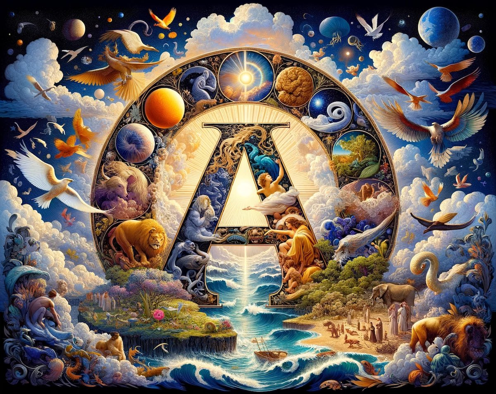

Some time ago, [thanks to Scott Aaronson](https://www.facebook.com/scott.aaronson.5/posts/pfbid0yn4ecJsiQi5Wjhq7mTwh2qCVoBzkWvKCDFgL3JZTxzKbhwcUR7qh89b83TRyw6zFl), I saw [a translation of Genesis 1 using only words starting with 'a'](http://llamasandmystegosaurus.blogspot.com/2017/05/alpha.html). It felt much in the line of constrained poetry, alike [Trurl's Electronic Bard](http://www.art.net/~hopkins/Don/lem/WonderfulPoems.html) written by Stanisław Lem and beautifully (ergo not faithfully) translated into English by Michael Kandel.

I got curious - which other letters work for this task? I went with 's'. Purely manually, with no help of AI or a voice from heaven.

> Supreme Spirit shaped: space, stone.  
> Stone shapeless, stark, shadowed. Surface suspended Supreme Spirit.  
> Supreme Spirit said: shine. Saw shine.

I didn't bother to finish - by induction, it will work for any number of lines.
Still, it would be a time-consuming task. Is be possible to generate such translation with AI?

At that time, GPT-3 was the best model. It didn't work at all. Neither did GPT3.5, the basis of the first ChatGPT - at least not out of the box. We can fine-tune these models, i.e. train them on additional, suitable data. See [GPT-2 Poetry](https://gwern.net/gpt-2) and [GPT-4 Creative Fiction](https://gwern.net/gpt-3) by Gwern.

GPT-4 turned out to be the game-changer - it works out of the box, in a zero-shot way. That is, the only thing you need is to give an instruction. There is no need to provide any examples, less so - perform fine-tuning. [My very first approach](https://www.facebook.com/piotr.migdal.9/posts/pfbid0utetW16tFfjgi9AD4uYR3VpQRCPgRVSpLdcfMCFWBJDjUhPaEE6SzoxGozGPFepRl) turned out to be decently successful:

> 1 At arrival, Almighty assembled above and abyss.  
> 2 Abyss absent actuality, abandoned, all around abysmal, Almighty's aura above aqua.  
> 3 Almighty articulated, "Actualize aurora," and aurora appeared.  
> 4 Almighty acknowledged aurora's appeal, and aurora away abyss.  
> 5 Almighty announced aurora "awake," and abyss "asleep." And afternoon, and aurora arrived—alpha age.  
> 6 Almighty articulated, "Assemble arch amid aqua, apart aqua and aqua."  
> 7 Accordingly, Almighty assembled arch, apart aqua adown arch and aqua atop. And accomplished.  
> 8 Almighty announced arch "atmosphere." And afternoon, and aurora arrived—another age.  
> 9 Almighty articulated, "Aggregate aqua adown atmosphere at area, also arid area arise." And accomplished.  
> 10 Almighty announced arid area "acreage," and aggregated aqua "aquatic." And Almighty agreed acceptable.  
> 11 Afterward Almighty articulated, "Acreage advance abundant: agricultural articles and arbores around acreage, abundant with almonds, assorted." And accomplished.  
> 12 Acreage advanced abundant: agricultural articles abundant with almonds assorted and arbores abundant with almonds assorted. And Almighty agreed acceptable.  
> 13 And afternoon, and aurora arrived—apex age.  
> 14 Almighty articulated, "Actualize astral above atmosphere, apart awake and asleep, also accenting appointed anniversaries, and ages and annuals,  
> 15 also as astral above atmosphere, allowing illumination around acreage." And accomplished.  
> 16 Almighty assembled ample astral—the ampler astral authorizing awake, and another astral authorizing asleep. Additionally, astronomical entities.  
> 17 Almighty allocated astral above atmosphere, allowing illumination around acreage,  
> 18 authorizing awake and asleep, and apart aurora and abyss. And Almighty agreed acceptable.  
> 19 And afternoon, and aurora arrived—quartet age.  
> 20 Almighty articulated, "Aqua abound animated entities, and avians ascend across atmosphere."  
> 21 Accordingly, Almighty actualized ample aquatic animals and animate aqua, agitated and active, assorted, and airborne avians assorted. And Almighty agreed acceptable.  
> 22 Almighty applauded and articulated, "Amplify and augment; add aqua animals and amplify avians around acreage."  
> 23 And afternoon, and aurora arrived—quintet age.  
> 24 Almighty articulated, "Actualize acreage animals assorted: animal agriculture, ambulatory animals, and animalistic, all assorted." And accomplished.  
> 25 Almighty actualized animalistic animals assorted, animal agriculture assorted, and ambulatory animals assorted. And Almighty agreed acceptable.  
> 26 Afterwards Almighty articulated, "Assemble anthropoids, alike and analogous us; authorize authority above aquatic and avians, above animal agriculture and animalistic animals, and above ambulatory animals around acreage."  
> 27 And Almighty actualized anthropoids, alike Almighty, analogous Almighty actualized; androgynous and gynandrous actualized.  
> 28 Almighty applauded and articulated, "Amplify and augment; annex acreage and administer. Administer aquatic and avians and above animate ambulatory animals."  
> 29 Almighty articulated, "Allocate agrarian almonds around all acreage and arbores abundant with almonds. Allocated as aliment.  
> 30 And animalistic animals and avians and ambulatory animals—all animated with animation—I allocate agrarian articles as aliment." And accomplished.  
> 31 Almighty admired all assembled, and absolutely amazing. And afternoon, and aurora arrived—adjacent age.

Sure, you can complain that a few words start with a different letter - the same way that [GPT-4 gets only a B on a quantum computing exam](https://scottaaronson.blog/?p=7209). While GPT4 translation skills are nowhere near that of [Yann LeCun's dog](https://twitter.com/ylecun/status/1622300311573651458) (for sure, they are [Border Collie](https://www.nationalgeographic.co.uk/animals/2021/07/some-dogs-are-geniuses-just-like-humans
https://twitter.com/ylecun/status/1622300311573651458)), I still find it impressive.

GPT-3.5 is stubborn - it is hard to move forward once it gets an answer (even if wildly incorrect). GPT-4 is much better at collaborating - it will try to apply your suggestions. If you point to an error, it will admit it and attempt to make suitable changes. Very often, it takes a few iterations to get a suitable result.

See also my previous blog posts [DALL·E 2 and transcendence - generating esoteric images with AI](https://p.migdal.pl/blog/2022/07/dall-e-2-and-transcendence/) (2022).
